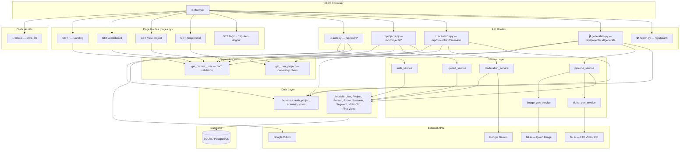
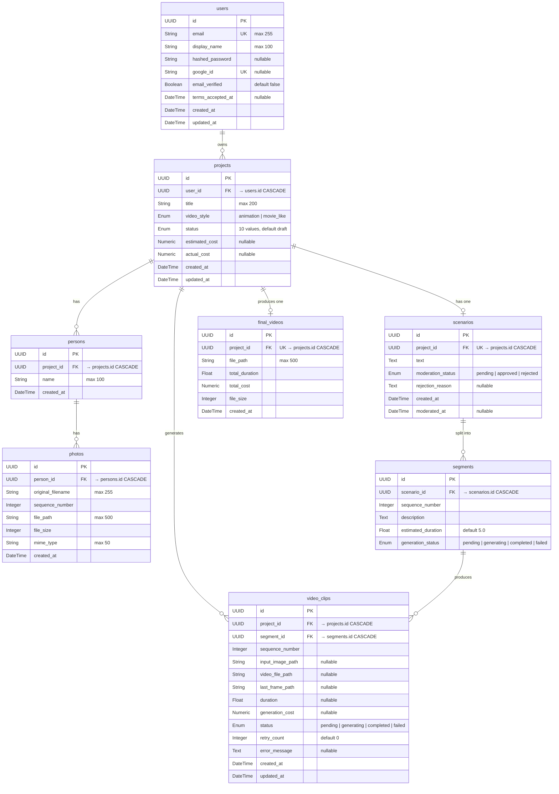
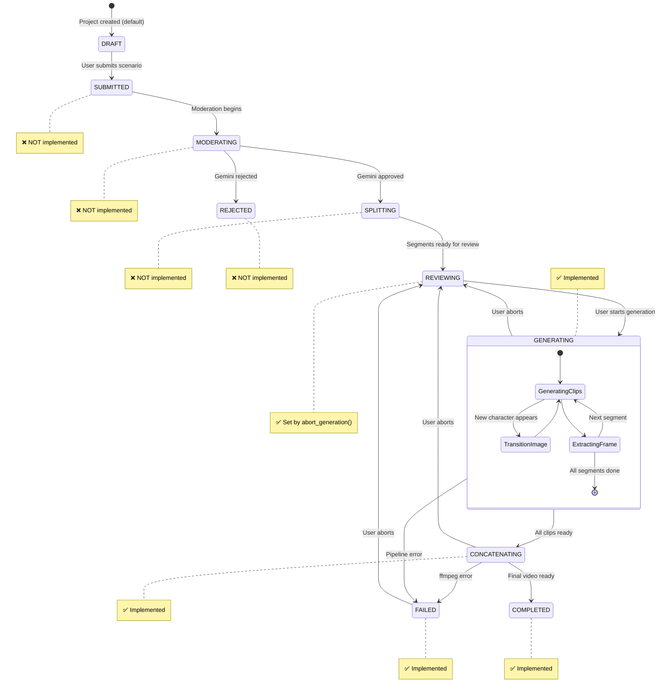
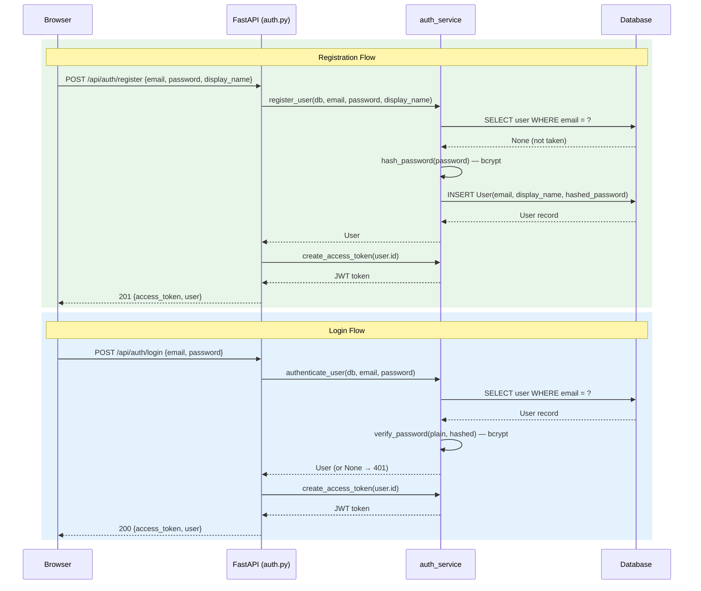
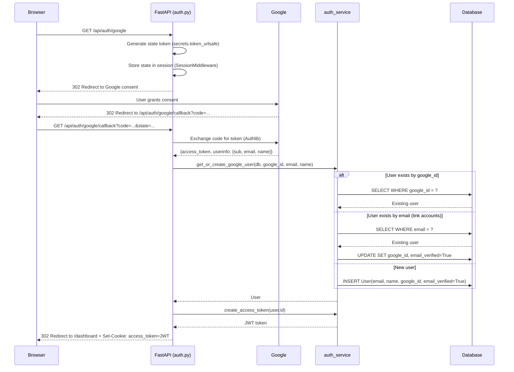
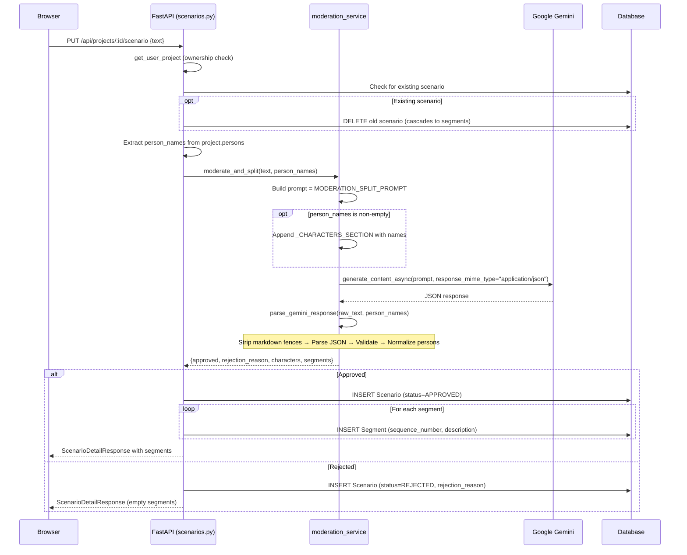
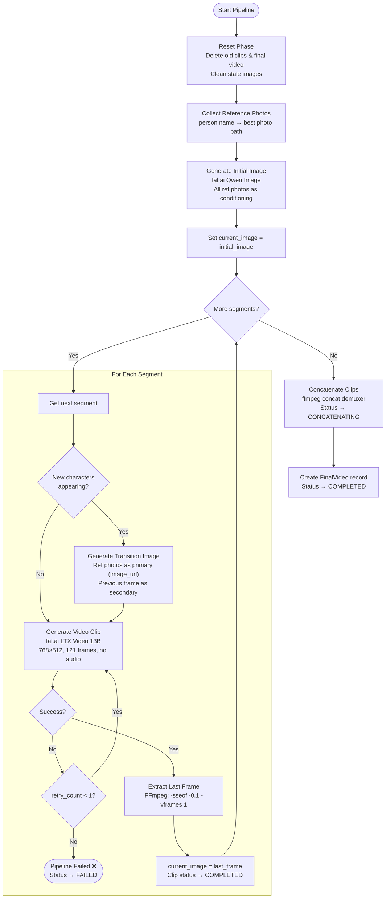
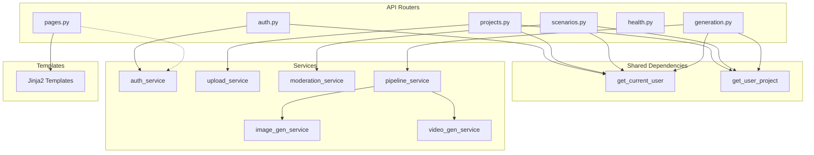

# Avatarium — Code Walkthrough

**Last verified against**: current `004-code-walkthrough-docs` branch  
**Platform**: AI-powered avatar video generation  
**Stack**: Python 3.12+ · FastAPI · SQLAlchemy (async) · Jinja2 · fal.ai · Google Gemini · JWT/bcrypt · Authlib

### Who Is This For?

This walkthrough is written for anyone who wants to understand how the Avatarium codebase works — even if you're relatively new to web development. Every technical term is explained when it first appears, and each section starts with a plain-language overview before diving into details.

### What Is Avatarium?

Avatarium is a **web application** — a program that runs on a server and is accessed through a web browser (like Chrome, Firefox, or Safari). Users visit Avatarium in their browser to:

1. **Create an account** (sign up with email/password or Google)
2. **Start a video project** by uploading photos of people
3. **Write a scenario** (a short story describing the video they want)
4. **Generate an AI-powered video** where the uploaded people appear in the scenario

The entire process — from uploading photos to watching the final video — happens through the browser. Behind the scenes, the server coordinates with several AI services to moderate content, generate images, and produce video clips.

---

## Table of Contents

1. [Architecture Overview](#1-architecture-overview)
2. [Configuration System](#2-configuration-system)
3. [Database Layer](#3-database-layer)
4. [Data Model & Enums](#4-data-model--enums)
5. [Authentication Flow](#5-authentication-flow)
6. [Photo Upload Pipeline](#6-photo-upload-pipeline)
7. [AI Moderation & Scenario Splitting](#7-ai-moderation--scenario-splitting)
8. [Video Generation Pipeline](#8-video-generation-pipeline)
9. [API Reference](#9-api-reference)
10. [Frontend & Templates](#10-frontend--templates)
11. [Middleware](#11-middleware)
12. [Logging](#12-logging)
13. [Test Infrastructure](#13-test-infrastructure)
14. [Migrations](#14-migrations)
15. [Implementation Status](#15-implementation-status)
16. [File Reference Index](#16-file-reference-index)

---

## Key Concepts Glossary

Before reading the walkthrough, here are the core technical terms you'll encounter. Each is explained in plain language.

### How a Web App Works (The Big Picture)

When you visit a website, here's what happens behind the scenes:

1. **Your browser** (the "client") sends a **request** to a remote computer (the "server") — for example, "show me the dashboard page."
2. **The server** receives the request, figures out what to do (look up data, check permissions, etc.), and sends back a **response** — usually an HTML page or JSON data.
3. **Your browser** displays the response to you.

This back-and-forth is called the **request-response cycle**, and it's the foundation of every web application.

### Terminology

| Term | Plain-Language Explanation |
|------|---------------------------|
| **API** (Application Programming Interface) | A set of URLs that a server exposes so programs (including browser JavaScript) can send and receive structured data (usually JSON). Think of it like a menu at a restaurant — it lists what you can order and what you'll get back. |
| **REST API** | A style of API where each URL represents a "resource" (like a project or a user) and you use HTTP methods (GET, POST, PUT, DELETE) to interact with them. |
| **Endpoint / Route** | A specific URL path that the server responds to, like `/api/projects` or `/api/auth/login`. Each endpoint does one thing. |
| **HTTP Methods** | The "verbs" of web requests: **GET** = retrieve data, **POST** = create something new, **PUT** = update/replace, **DELETE** = remove. |
| **JSON** (JavaScript Object Notation) | A text format for structured data that looks like `{"name": "Alice", "age": 30}`. APIs use it to send and receive data. |
| **Server** | A computer (or program) that listens for incoming requests and sends back responses. Avatarium's server is written in Python using FastAPI. |
| **Client** | The program making requests — usually your web browser, but can also be a mobile app or another server. |
| **Frontend** | Everything the user sees and interacts with in the browser — HTML pages, CSS styling, JavaScript behavior. |
| **Backend** | Everything running on the server — request handling, business logic, database access, API calls to external services. |
| **Database** | A structured storage system where the application saves data permanently (users, projects, photos, etc.). Think of it like a collection of spreadsheets where each table is a sheet and each row is a record. |
| **ORM** (Object-Relational Mapper) | A tool that lets you work with database records as Python objects instead of writing raw SQL queries. Avatarium uses SQLAlchemy. |
| **Schema** | A definition of what shape data should have — like a form template that says "this field is required, this one is optional, this must be a number." Avatarium uses Pydantic schemas to validate incoming requests and shape outgoing responses. |
| **Middleware** | Code that runs on *every* request before it reaches your endpoint — like a security guard at the door. Used for rate limiting, session management, etc. |
| **Authentication** ("Auth") | Proving *who you are* — logging in with a password or Google account. |
| **Authorization** | Determining *what you're allowed to do* — e.g., you can only see your own projects, not other people's. |
| **JWT** (JSON Web Token) | A small, signed piece of data the server gives you after login. You send it with every request to prove you're logged in, like a wristband at a concert. |
| **OAuth** | A protocol that lets you log in with an existing account (like Google) instead of creating a new password. The app redirects you to Google, you approve, and Google tells the app who you are. |
| **Cookie** | A small piece of data the server tells your browser to store. The browser sends it back automatically with every request — used here to keep you logged in on page navigation. |
| **Environment Variable** | A configuration value set outside the code (like a password or API key). This keeps secrets out of the source code. |
| **Async / Asynchronous** | A programming style where the server can handle many requests at once without waiting for slow operations (like database queries or API calls) to finish. |
| **Migration** | A versioned change to the database structure (adding a table, adding a column, etc.). Migrations let you evolve the database over time without losing data. |
| **UUID** | A universally unique identifier — a long random string like `550e8400-e29b-41d4-a716-446655440000`. Used as IDs because they're virtually impossible to guess or collide. |
| **Hash / Hashing** | A one-way mathematical function that turns a password into a scrambled string. You can verify a password against its hash, but you can't reverse the hash back to the password. Avatarium uses bcrypt for this. |
| **MIME Type** | A label describing a file's format, like `image/jpeg` for JPEG photos or `application/json` for JSON data. |
| **FK** (Foreign Key) | A column in one database table that points to a row in another table — like a reference link. For example, every project has a `user_id` FK pointing to the user who owns it. |
| **PK** (Primary Key) | The unique identifier for each row in a table — no two rows can have the same PK. |
| **CASCADE** | A rule that says "if I delete the parent, automatically delete all children." For example, deleting a project cascades to delete all its photos, scenarios, and videos. |

---

## 1. Architecture Overview

Avatarium is a server-rendered FastAPI application with API endpoints that power both the Jinja2 template pages and any future client integrations. The architecture is organized into distinct layers, each with a clear responsibility.

> **What does "server-rendered" mean?** When you visit a page like `/dashboard`, the server builds the complete HTML page (filling in your name, your projects, etc.) and sends the finished page to your browser. This is different from "client-rendered" apps (like React SPAs) where the browser downloads a blank page and JavaScript fills in the content afterward. Avatarium uses a middle ground: the server renders the initial pages, but JavaScript on the page makes additional API calls for dynamic features like file uploads and status polling.

> **What is FastAPI?** FastAPI is a Python web framework — a toolkit for building web servers. It handles the boring parts (listening for HTTP requests, routing them to the right function, sending responses) so developers can focus on business logic. It's called "Fast" because it's both high-performance and fast to develop with.

> **What is Jinja2?** Jinja2 is a **template engine**. Think of it like a mail merge: you write an HTML page with placeholders like `{{ user.name }}`, and Jinja2 fills in the actual values before sending the page to the browser.

### Layers

| Layer | Responsibility | Key Files |
|-------|---------------|-----------|
| **Client / Browser** | Renders HTML, executes JS for upload, polling, and auth token management | `static/js/app.js`, `static/css/style.css` |
| **Static Assets** | Served by FastAPI's `StaticFiles` mount at `/static` | `static/` directory |
| **Page Routes** | Server-rendered HTML pages via Jinja2; cookie-based auth | `backend/api/pages.py` |
| **API Routes** | JSON REST endpoints; Bearer JWT auth | `backend/api/auth.py`, `projects.py`, `scenarios.py`, `generation.py`, `health.py` |
| **Dependencies** | Shared FastAPI dependencies (ownership verification, auth) | `backend/api/dependencies.py`, `backend/api/auth.py::get_current_user` |
| **Service Layer** | Business logic; isolated from HTTP concerns | `backend/services/auth_service.py`, `upload_service.py`, `moderation_service.py`, `pipeline_service.py`, `image_gen_service.py`, `video_gen_service.py`, `fal_polling.py`, `_utils.py` |
| **Data Layer** | SQLAlchemy ORM models + Pydantic schemas | `backend/models/`, `backend/schemas/` |
| **Database** | Async SQLite (dev) / PostgreSQL (prod) via `aiosqlite` | `backend/database.py` |
| **External APIs** | fal.ai (image + video generation), Google Gemini (moderation), Google OAuth | Called from service layer |

### Application Entry Point

`backend/main.py` contains the `create_app()` factory function. This is the single place where the entire application is assembled and configured — it's the first thing that runs when the server starts.

> **What is a factory function?** Instead of configuring the app at the top of a file (which makes testing hard), the setup is wrapped in a function called `create_app()`. Every time you call it, you get a fresh app instance. This is especially useful for testing, where you want a clean app for each test.

> **What is a lifespan context manager?** It's a way to run setup code when the server starts (like "connect to the database") and cleanup code when the server stops (like "disconnect from the database"). Think of it like opening and closing a shop — you turn on the lights when you open and turn them off when you close.

Here's what `create_app()` does, step by step:

1. Creates the `FastAPI` instance with a `lifespan` context manager
2. On startup: calls `setup_logging()` to begin recording activity, then `create_all()` in development mode to ensure database tables exist
3. On shutdown: calls `dispose_engine()` to cleanly close all database connections
4. Attaches the `SlowAPI` rate limiter to `app.state.limiter` — this prevents any single user from flooding the server with too many requests
5. Adds `SessionMiddleware` (required for Google OAuth to work — it needs to remember state between the redirect to Google and the callback)
6. Mounts `/static` so the browser can load CSS stylesheets and JavaScript files
7. Includes all 6 **routers** (groups of related endpoints): health, auth, projects, scenarios, generation, pages



---

## 2. Configuration System

**File**: `backend/config.py`

> **Why do apps need configuration?** Every application needs certain values to run — database addresses, API keys for external services, secret keys for encryption, etc. These values change depending on where the app runs (your laptop vs. a production server), so they should **never** be hard-coded in the source code. Instead, they're stored in **environment variables** — named values set outside the code, like `DATABASE_URL=postgres://...` or `JWT_SECRET_KEY=my-secret`. This way, the same code works everywhere, and secrets stay out of the Git repository.

> **What is a `.env` file?** Instead of setting 15 environment variables one by one in your terminal, you can write them all in a `.env` file (a simple text file with `KEY=value` lines). The app reads this file on startup. This file should be listed in `.gitignore` so it's never committed.

All configuration is loaded from environment variables (or a `.env` file) using `pydantic-settings`. A single `Settings` class holds every configurable value with sensible defaults — meaning the app can start with minimal setup because most values have reasonable fallbacks.

### Settings Groups

| Group | Variables | Purpose |
|-------|-----------|---------|
| **App** | `app_env`, `app_secret_key`, `app_host`, `app_port` | Runtime environment, session secret, bind address |
| **Database** | `database_url` | SQLAlchemy connection string (default: `sqlite+aiosqlite:///./avatarium.db`) |
| **fal.ai** | `fal_key`, `fal_image_model`, `fal_video_model` | API key and model identifiers for image/video generation |
| **Gemini** | `gemini_api_key`, `gemini_model` | Google Gemini API for content moderation (default: `gemini-2.5-flash`) |
| **Google OAuth** | `google_client_id`, `google_client_secret`, `google_redirect_uri` | OAuth 2.0 / OpenID Connect credentials |
| **JWT** | `jwt_secret_key`, `jwt_algorithm`, `jwt_expiration_minutes` | Token signing (HS256, 60-minute expiry) |
| **Rate Limiting** | `rate_limit_default` | SlowAPI default rate (default: `10/minute`) |

### Key Patterns

- **Singleton**: `settings = Settings()` is created once when the module is first imported, and every other file in the project shares that same instance. This means there's only ever one copy of the configuration in memory.
  > **In plain terms**: Imagine the configuration as a single notice board in the office. Everyone reads from the same board — nobody has their own copy that could get out of sync.
- **Environment detection**: Two helper properties that answer "what mode are we running in?":
  - `is_development` → `True` when `app_env == "development"` — enables verbose SQL logging in the console and auto-creates database tables on startup (convenient for local development).
  - `is_production` → `True` when `app_env == "production"` — enables secure cookie flags and disables auto-table-creation (in production, database changes go through formal migrations).
- **Case-insensitive**: `case_sensitive=False` means `APP_ENV`, `app_env`, and `App_Env` all work — you don't have to worry about the exact casing of your environment variables.

---

## 3. Database Layer

**File**: `backend/database.py`

> **What is a database, and why do we need one?** When a user creates an account or uploads a photo, that information needs to be saved somewhere permanent — so it's still there when the user comes back tomorrow. A **database** is that permanent storage. It organizes data into **tables** (like spreadsheets), where each row is one record (e.g., one user) and each column is a property (e.g., email, name, password).

> **What does "async" mean here?** Normally, when your code asks the database a question, it sits and waits for the answer before doing anything else. With **async** (asynchronous) code, the server can handle other users' requests while waiting for the database to respond. This is like a restaurant where the waiter takes multiple tables' orders instead of standing at the kitchen window waiting for one dish at a time.

### Async Engine & Session

The **engine** is the connection pipeline between the application and the database. The **session** is like a shopping cart for database operations — you add, modify, and remove items, then either "checkout" (commit) to save everything, or "empty the cart" (rollback) if something went wrong.

```python
engine = create_async_engine(settings.database_url, echo=settings.is_development, future=True)

async_session_factory = async_sessionmaker(
    engine, class_=AsyncSession, expire_on_commit=False
)
```

- **`expire_on_commit=False`**: Normally, after saving data to the database, SQLAlchemy "forgets" the object's attributes (so it would have to ask the database again if you read them). In async code, that re-fetching doesn't work well, so this setting tells SQLAlchemy to keep the data in memory after saving. Objects remain usable without issuing new queries.
- **`future=True`**: Enables the modern SQLAlchemy 2.0 style of writing queries.

### `get_db()` Dependency

> **What is a "dependency" in FastAPI?** A dependency is a function that runs automatically before your endpoint code. FastAPI's **dependency injection** system lets you say "this endpoint needs a database session" and FastAPI will create one, pass it in, and clean it up afterward. This keeps endpoint code clean and prevents resource leaks.

```python
async def get_db() -> AsyncGenerator[AsyncSession, None]:
    async with async_session_factory() as session:
        try:
            yield session
            await session.commit()
        except Exception:
            await session.rollback()
            raise
```

This FastAPI dependency works like a loan system for database connections:
1. Opens a session (database connection) from the factory
2. **Yields** it to the route handler — "here, use this session for your work"
3. **Auto-commits** on success — if the endpoint finishes without errors, all changes are saved to the database. Route handlers never need to manually call `commit()`; they only call `flush()` when they need to get auto-generated IDs mid-operation
4. **Auto-rolls-back** on any exception — if anything goes wrong, *all* changes are undone, leaving the database in a clean state
5. Session is automatically closed when done — the connection is returned to the pool for reuse

### Helper Functions

| Function | What It Does |
|----------|-------------|
| `create_all()` | Looks at all the model definitions (User, Project, Photo, etc.) and creates the corresponding database tables if they don't exist. Only runs during development so you don't have to manually create tables while coding. |
| `dispose_engine()` | Closes all database connections cleanly when the server shuts down. Like checking out of a hotel — you return the room key. |

### Entity-Relationship Diagram

The diagram below shows all 8 database tables and how they relate to each other. Reading guide:

- **PK** = Primary Key (the unique ID for each row)
- **FK** = Foreign Key (a reference pointing to a row in another table)
- **UK** = Unique Key (this value can't be duplicated across rows)
- Lines between tables show relationships: `||--o{` means "one to many" (one user can have many projects), `||--o|` means "one to zero-or-one" (one project has at most one scenario)
- Text in quotes after each field describes constraints or defaults



---

## 4. Data Model & Enums

This section describes every database table in detail — what each column stores, what rules it follows, and how tables connect to each other.

> **What are "enums"?** Short for "enumerations" — a fixed set of allowed values. For example, a traffic light can only be `red`, `yellow`, or `green`. In Avatarium, `ProjectStatus` is an enum with values like `draft`, `generating`, `completed`. Using enums prevents invalid values (you can't accidentally set a status to `banana`).

> **Reading the tables below**: Each table describes a database table's columns. Key terms:
> - **Type**: What kind of data the column holds (text, number, date, true/false, etc.)
> - **Constraints**: Rules the database enforces — like `NOT NULL` (this field is required), `UNIQUE` (no duplicates allowed), or `FK` (this points to another table)
> - **nullable**: The field is *optional* — it can be left empty

### Table Descriptions

#### `users` — `backend/models/user.py`

This table stores every registered user. Each user has either a password (for email login) or a Google ID (for Google login) — or both if they've linked their accounts.

| Column | Type | Constraints | Notes |
|--------|------|-------------|-------|
| `id` | UUID | PK, auto-generated | `uuid.uuid4` default |
| `email` | String(255) | UNIQUE, NOT NULL, indexed | Login identifier |
| `display_name` | String(100) | NOT NULL | Shown in UI |
| `hashed_password` | String(255) | nullable | NULL for Google-only accounts |
| `google_id` | String(255) | UNIQUE, nullable | Populated on Google OAuth |
| `email_verified` | Boolean | NOT NULL, default `False` | Auto-set `True` for Google OAuth; **no verification flow exists** — see [Section 15](#15-implementation-status) |
| `terms_accepted_at` | DateTime(tz) | nullable | Column exists but **no acceptance flow** — see [Section 15](#15-implementation-status) |
| `created_at` | DateTime(tz) | NOT NULL, server_default `now()` | |
| `updated_at` | DateTime(tz) | NOT NULL, server_default `now()`, onupdate | |

#### `projects` — `backend/models/project.py`

A project is the central unit of work: it groups together a user's photos, their scenario, and the generated videos. Every project belongs to exactly one user.

| Column | Type | Constraints | Notes |
|--------|------|-------------|-------|
| `id` | UUID | PK | |
| `user_id` | UUID | FK → `users.id` CASCADE, NOT NULL, indexed | Ownership |
| `title` | String(200) | NOT NULL | |
| `video_style` | Enum(VideoStyle) | NOT NULL | `animation` or `movie_like` |
| `status` | Enum(ProjectStatus) | NOT NULL, default `draft` | 10-value lifecycle — see state diagram below |
| `estimated_cost` | Numeric(6,4) | nullable | Pre-generation estimate |
| `actual_cost` | Numeric(6,4) | nullable | Post-generation actual |
| `created_at` | DateTime(tz) | NOT NULL | |
| `updated_at` | DateTime(tz) | NOT NULL, onupdate | |

**Relationships**: `persons` loaded via `selectin` eager loading — this means whenever you load a project from the database, SQLAlchemy automatically loads all associated persons in the same query, so you don't get errors when trying to access them later.

#### `persons` — `backend/models/project.py`

A person is a character in the video. Persons are created automatically when photos are uploaded — the person's name is extracted from the filename (e.g., uploading `alice_1.jpg` creates a person named `alice`).

| Column | Type | Constraints | Notes |
|--------|------|-------------|-------|
| `id` | UUID | PK | |
| `project_id` | UUID | FK → `projects.id` CASCADE, NOT NULL, indexed | |
| `name` | String(100) | NOT NULL | Derived from photo filenames (e.g., `alice` from `alice_1.jpg`) |
| `created_at` | DateTime(tz) | NOT NULL | |

**Unique constraint**: `(project_id, name)` — one person per name per project.
**Relationships**: `photos` loaded via `selectin` (same eager loading pattern as projects → persons).

#### `photos` — `backend/models/project.py`

Each photo is a reference image of a person. The actual image file is stored on disk; the database row tracks metadata (filename, size, location).

| Column | Type | Constraints | Notes |
|--------|------|-------------|-------|
| `id` | UUID | PK | |
| `person_id` | UUID | FK → `persons.id` CASCADE, NOT NULL, indexed | |
| `original_filename` | String(255) | NOT NULL | Original upload filename |
| `sequence_number` | Integer | NOT NULL | From filename (e.g., `1` from `alice_1.jpg`) |
| `file_path` | String(500) | NOT NULL | `uploads/{user_id}/{project_id}/{filename}` |
| `file_size` | Integer | NOT NULL | Bytes |
| `mime_type` | String(50) | NOT NULL | `image/jpeg`, `image/png`, or `image/webp` |
| `created_at` | DateTime(tz) | NOT NULL | |

**Unique constraint**: `(person_id, sequence_number)` — no duplicate sequence per person.

#### `scenarios` — `backend/models/scenario.py`

A scenario is the user's description of the video they want. It's sent to Google Gemini AI for content moderation (checking for inappropriate content) and splitting into individual scenes.

| Column | Type | Constraints | Notes |
|--------|------|-------------|-------|
| `id` | UUID | PK | |
| `project_id` | UUID | FK → `projects.id` CASCADE, UNIQUE, NOT NULL, indexed | **One scenario per project** |
| `text` | Text | NOT NULL | Raw user-submitted scenario |
| `moderation_status` | Enum(ModerationStatus) | NOT NULL, default `pending` | |
| `rejection_reason` | Text | nullable | Populated by Gemini on rejection |
| `created_at` | DateTime(tz) | NOT NULL | |
| `moderated_at` | DateTime(tz) | nullable | Timestamp of moderation response |

**Relationships**: `segments` loaded via `selectin`, ordered by `sequence_number` (so scenes always appear in the right order).

#### `segments` — `backend/models/scenario.py`

A segment is one scene within a scenario. When the AI splits a scenario into parts, each part becomes a segment. Segments are processed in order to generate video clips.

| Column | Type | Constraints | Notes |
|--------|------|-------------|-------|
| `id` | UUID | PK | |
| `scenario_id` | UUID | FK → `scenarios.id` CASCADE, NOT NULL, indexed | |
| `sequence_number` | Integer | NOT NULL | 1-based ordering |
| `description` | Text | NOT NULL | Scene description for video generation |
| `estimated_duration` | Float | NOT NULL, default `5.0` | Seconds |
| `generation_status` | Enum(GenerationStatus) | NOT NULL, default `pending` | |

**Unique constraint**: `(scenario_id, sequence_number)`.

#### `video_clips` — `backend/models/video.py`

Each video clip corresponds to one segment. The pipeline generates an image, then converts it to a short video clip. The `last_frame_path` column is key to the "chaining" mechanism — the last frame of each clip becomes the starting image for the next clip, ensuring visual continuity.

| Column | Type | Constraints | Notes |
|--------|------|-------------|-------|
| `id` | UUID | PK | |
| `project_id` | UUID | FK → `projects.id` CASCADE, NOT NULL, indexed | |
| `segment_id` | UUID | FK → `segments.id` CASCADE, NOT NULL, indexed | |
| `sequence_number` | Integer | NOT NULL | Matches segment sequence |
| `input_image_path` | String(500) | nullable | Path to input frame |
| `video_file_path` | String(500) | nullable | Path to generated clip |
| `last_frame_path` | String(500) | nullable | Extracted last frame for chaining |
| `duration` | Float | nullable | Actual clip duration |
| `generation_cost` | Numeric(6,4) | nullable | fal.ai API cost |
| `status` | Enum(ClipStatus) | NOT NULL, default `pending` | |
| `retry_count` | Integer | NOT NULL, default `0` | |
| `error_message` | Text | nullable | Populated on failure |
| `created_at` | DateTime(tz) | NOT NULL | |
| `updated_at` | DateTime(tz) | NOT NULL, onupdate | |

#### `final_videos` — `backend/models/video.py`

The final video is what the user actually watches — all the individual clips concatenated (joined end-to-end) into one continuous video.

| Column | Type | Constraints | Notes |
|--------|------|-------------|-------|
| `id` | UUID | PK | |
| `project_id` | UUID | FK → `projects.id` CASCADE, UNIQUE, NOT NULL, indexed | **One final video per project** |
| `file_path` | String(500) | NOT NULL | |
| `total_duration` | Float | NOT NULL | |
| `total_cost` | Numeric(6,4) | NOT NULL | |
| `file_size` | Integer | NOT NULL | |
| `created_at` | DateTime(tz) | NOT NULL | |

> **Note**: The `FinalVideo` model has a `UNIQUE` constraint on `project_id`, meaning each project can have at most one final video. The pipeline creates a `FinalVideo` record after successful concatenation and deletes any previous record before a re-run.

### Enum Types

#### `VideoStyle` — `backend/models/project.py`

| Value | Description |
|-------|-------------|
| `animation` | Cartoon/stylized animation style — prompt prefix: "cartoon, stylized animation style" |
| `movie_like` | Realistic/cinematic movie style — prompt prefix: "realistic, cinematic movie style" |

#### `ProjectStatus` — `backend/models/project.py`

| Value | Intended Meaning | Actually Used? |
|-------|------------------|----------------|
| `draft` | Initial state on creation | ✅ Default value |
| `submitted` | User submitted scenario | ❌ Never assigned |
| `moderating` | Gemini moderation in progress | ❌ Never assigned |
| `splitting` | Scenario being split into segments | ❌ Never assigned |
| `reviewing` | User reviewing segments | ✅ Set in `generation.py::abort_generation()` |
| `generating` | Video pipeline running | ✅ Set in `generation.py::start_generation()` |
| `concatenating` | Clips being joined | ✅ Set in `pipeline_service.py` after all clips rendered |
| `completed` | Final video ready | ✅ Set in `pipeline_service.py` after concatenation |
| `rejected` | Scenario failed moderation | ❌ Never assigned |
| `failed` | Pipeline error | ✅ Set in `pipeline_service.py` via `_fail()` helper |

See the [Project Status State Machine](#project-status-state-machine) below for the full intended lifecycle.

#### `ModerationStatus` — `backend/models/scenario.py`

| Value | Description | Used? |
|-------|-------------|-------|
| `pending` | Default — awaiting moderation | ✅ Default |
| `approved` | Gemini approved the scenario | ✅ Set in `scenarios.py` |
| `rejected` | Gemini rejected the scenario | ✅ Set in `scenarios.py` |

#### `GenerationStatus` — `backend/models/scenario.py`

| Value | Description | Used? |
|-------|-------------|-------|
| `pending` | Awaiting video generation | ✅ Default |
| `generating` | Currently being generated | ❌ Never assigned |
| `completed` | Clip generated successfully | ❌ Never assigned |
| `failed` | Generation failed | ❌ Never assigned |

#### `ClipStatus` — `backend/models/video.py`

| Value | Description | Used? |
|-------|-------------|-------|
| `pending` | Awaiting generation | ✅ Default |
| `generating` | Currently generating | ✅ Set in `pipeline_service.py` before each clip |
| `completed` | Generated successfully | ✅ Set in `pipeline_service.py` after clip + frame extraction |
| `failed` | Generation failed | ✅ Set in `pipeline_service.py` via `_fail()` helper |

### Project Status State Machine

The following diagram shows the **intended** full lifecycle as designed by the `ProjectStatus` enum. Since most transitions are not yet wired in code, transitions are annotated with their implementation status.



> **Current state**: The following transitions are implemented in code:
> 1. `→ DRAFT` — automatic default when a project is created
> 2. `any → GENERATING` — triggered by `POST /api/projects/{id}/generate` in `generation.py`
> 3. `GENERATING → CONCATENATING` — set by `pipeline_service.py` after all clips are rendered
> 4. `CONCATENATING → COMPLETED` — set by `pipeline_service.py` after successful ffmpeg concatenation
> 5. `GENERATING / CONCATENATING → FAILED` — set by `pipeline_service.py` on any unrecoverable error
> 6. `GENERATING / CONCATENATING / FAILED → REVIEWING` — triggered by `POST /api/projects/{id}/abort`
>
> The intermediate moderation-flow transitions (`SUBMITTED`, `MODERATING`, `SPLITTING`, `REJECTED`) exist as enum values but have no code to trigger them. The scenario moderation flow in `scenarios.py` sets `ModerationStatus` on the `Scenario` record but does **not** update `ProjectStatus`.

---

## 5. Authentication Flow

**Files**: `backend/api/auth.py`, `backend/services/auth_service.py`, `backend/api/pages.py`, `backend/schemas/auth.py`

> **What is authentication?** Authentication is the process of proving who you are. When you log in with your email and password, you're authenticating — telling the server "I am this person." The server then gives you proof of your identity (a token) that you show on subsequent requests so you don't have to log in again for every page.

> **Authentication vs. Authorization**: These are often confused. **Authentication** = "Who are you?" (logging in). **Authorization** = "What are you allowed to do?" (e.g., can you view this project? Only if it's yours).

Avatarium supports two authentication methods that share a unified `User` model:

1. **Email / password** — The traditional way: you create an account with an email and password. The password is **hashed** (scrambled using bcrypt, a one-way function) before being stored, so even if someone stole the database, they couldn't see your actual password.
2. **Google OAuth** — The "Sign in with Google" button. Instead of creating a new password, you authorize Avatarium to get your name and email from Google. This uses the Authlib library to implement the OAuth protocol.

### Authentication Mechanisms

#### JWT Tokens (API Routes)

> **What is a JWT?** A JSON Web Token is like a digitally-signed ID card. After you log in, the server creates a small piece of data containing your user ID and an expiration time, then signs it with a secret key. You send this token with every API request. The server can verify the signature to confirm it issued that token and that it hasn't been tampered with — without needing to look anything up in the database.

- Created by `create_access_token(user_id)` with payload: `{sub: str(user_id), exp, iat}`
  - `sub` = "subject" (who this token is for — the user's ID)
  - `exp` = when the token expires
  - `iat` = when the token was issued
- Signed with `HS256` (a cryptographic algorithm) using `jwt_secret_key`, expires in 60 minutes (configurable)
- Passed as `Authorization: Bearer <token>` header — this is a standard HTTP convention where the browser/JavaScript includes the token in the request header
- Validated by `get_current_user` dependency (extracts the token from the `Authorization` header and decodes it)

#### Cookie Auth (Page Routes)

> **What is a cookie?** A cookie is a small piece of data that the server tells the browser to store. The browser then automatically includes that data in every future request to the same server. This is how websites "remember" that you're logged in as you navigate from page to page.

- Google OAuth callback sets an `access_token` cookie (httponly=False, samesite=lax) — this means the cookie is accessible to JavaScript (needed for API calls) and is sent on same-site navigations
- `pages.py` reads the cookie via `_get_current_user_or_none(request, db)` to check if the user is logged in
- Pages redirect to `/login` if no valid cookie is found

### Account Linking

> **Why link accounts?** A user might first register with email/password, then later click "Sign in with Google" using the same email. Without account linking, this would create a duplicate account. The linking logic prevents this by checking for existing accounts before creating a new one.

`get_or_create_google_user(db, google_id, email, display_name)` performs a three-step lookup:
1. **Find by `google_id`** → return existing user (they've logged in with Google before)
2. **Find by `email`** → link the Google account to the existing email account (set `google_id`, set `email_verified=True`)
3. **Neither found** → create a brand new user with `email_verified=True`

### Scaffolded Features
- **`email_verified`** column exists but **no email verification flow** (no verification email, no token, no endpoint). Google OAuth users get `True` automatically; email registrations stay `False`. See [Section 15](#15-implementation-status).
- **`terms_accepted_at`** column exists but **no Terms of Use acceptance flow** (no endpoint, no middleware gate). See [Section 15](#15-implementation-status).

### Email Registration & Login Sequence



### Google OAuth Sequence



---

## 6. Photo Upload Pipeline

**Files**: `backend/api/projects.py` (upload endpoint), `backend/services/upload_service.py`, `backend/api/dependencies.py`

> **What is a "pipeline"?** In software, a pipeline is a series of steps that data passes through, one after another. Each step either transforms the data or checks it against some rule. If any step fails, the pipeline stops and reports an error. Think of it like an airport security line — your bag goes through an X-ray (step 1), then a weight check (step 2), then tagging (step 3).

Uploading photos establishes the "cast" of person characters for a project. Each photo is assigned to a person derived from the filename convention `<personName>_<sequenceNumber>.<ext>`.

> **Why does the filename matter?** Instead of requiring a separate form to name each person, Avatarium uses a simple naming convention. If you upload `alice_1.jpg`, `alice_2.jpg`, and `bob_1.jpg`, the system automatically creates two persons: `alice` (with 2 photos) and `bob` (with 1 photo). The number after the underscore determines the ordering of photos for each person.

### Validation Gates

Before saving any file, it must pass through several safety checks (each numbered step below). If any check fails, the file is rejected with a `400 Bad Request` error and a descriptive message.

1. **Ownership**: `get_user_project(project_id, user_id, db)` verifies the project belongs to the authenticated user (returns 404 if not) — this prevents users from uploading photos to other people's projects
2. **MIME type**: Must be one of `image/jpeg`, `image/png`, `image/webp` — this prevents non-image files (PDFs, executables, etc.) from being uploaded
3. **File size**: Maximum 10 MB (10,485,760 bytes) — prevents the server from running out of disk space or memory
4. **Filename format**: Must match regex `^(?P<person>[a-zA-Z0-9]+)_(?P<seq>\d+)\.(?P<ext>[a-zA-Z0-9]+)$` — ensures the `personName_number.extension` convention is followed
   > **What is a regex?** A "regular expression" is a pattern-matching language. This regex says: "one or more letters/numbers, then an underscore, then one or more digits, then a dot, then the file extension." Anything that doesn't match this pattern (like `my photo.jpg` or `alice.jpg`) is rejected.
5. **Extension**: Derived extension must be in `{jpg, jpeg, png, webp}` — double-checks that the file extension matches an allowed image format
6. **Photo count**: Maximum 10 photos per person per project — prevents excessive resource usage

### Person Management
- Person name is extracted from filename and **normalized to lowercase** (`Alice_1.jpg` → person `alice`) — this means `Alice_1.jpg` and `alice_2.jpg` are treated as the same person
- Persons are **get-or-created**: the system checks if a person with that name already exists for the project. If yes, the new photo is added to that person. If no, a new person record is created first.
- Unique constraint `(project_id, name)` at the database level guarantees no duplicate person records, even if two requests arrive simultaneously

### Storage Pattern
Files are saved to: `uploads/{user_id}/{project_id}/{original_filename}`

Each user's data is completely isolated by the directory structure.

### Upload Flow


---

## 7. AI Moderation & Scenario Splitting

**Files**: `backend/api/scenarios.py`, `backend/services/moderation_service.py`, `backend/schemas/scenario.py`

> **What is content moderation?** Content moderation is the process of reviewing user-submitted content to ensure it follows the platform's rules. On social media, this might be done by human reviewers. In Avatarium, we use AI (Google Gemini) to automatically check the user's scenario text for policy violations like violence, hate speech, or illegal content — before any video is generated.

> **What is "scene splitting"?** A user writes a single paragraph or page describing their full video scenario. But videos are generated one short clip at a time (about 5 seconds each). So the AI also splits the user's text into individual segments, each describing one "scene" that can be turned into a clip. This moderation + splitting happens in a single AI call.

When a user submits a scenario, it is sent to Google Gemini in a single API call that performs **both** content moderation and scene splitting simultaneously.

### Prompt Architecture

> **What is a "prompt" in AI?** When you interact with an AI model like ChatGPT or Google Gemini, the text you send is called a "prompt". It's the instruction that tells the AI what to do. In Avatarium, the prompt isn't typed by the user directly — instead, the backend constructs it programmatically by combining rules, the user's scenario text, and character information.

The prompt has two parts assembled dynamically:

1. **`MODERATION_SPLIT_PROMPT`** (always included): Contains content policy rules (violence, sexual content, hate speech, illegal activities, minor exploitation, self-harm) and splitting rules (max 15 segments, ~5s each, coherent scenes, visual details).

2. **`_CHARACTERS_SECTION`** (appended only when `person_names` is non-empty): Instructs Gemini to:
   - Reference each character by name in segments where they appear
   - Invent a short visual description (2-3 traits) per character and **reuse it exactly**
   - Describe spatial relationships instead of frame positions
   - Populate a `"characters"` manifest mapping `name → visual_description`
   - Populate per-segment `"persons"` arrays listing character names present

### Response Parsing (`parse_gemini_response`)

> **Why do we need to parse the response?** The AI returns its answer as text. Even though we ask it to respond in JSON format, AI models can sometimes add extra characters (like markdown code fences `` ``` ``), return malformed JSON, or include unexpected data. The parsing step carefully extracts the data, validates it has the right structure, and cleans up inconsistencies — because we can never fully trust AI output to be perfectly formatted.

1. Strip markdown code fences (`` ```json ... ``` ``) if present
2. Parse JSON
3. Validate required keys: `approved`, `segments`
4. Enforce max 15 segments (truncate if exceeded)
5. Validate `characters` is `dict[str, str]` (if persons provided)
6. Per-segment validation:
   - `persons` must be `list[str]`
   - Normalize all names to lowercase
   - Filter out names not in the project's person list (the AI sometimes invents characters that don't exist)

### Re-submission
If a scenario already exists for the project, it is **deleted** (cascading to segments) before creating the new one. This allows users to iterate on their scenario.

### Moderation & Splitting Sequence



---

## 8. Video Generation Pipeline

**Files**: `backend/services/pipeline_service.py`, `backend/services/image_gen_service.py`, `backend/services/video_gen_service.py`, `backend/api/generation.py`

> **What is a "generation pipeline"?** This is the core of Avatarium — the multi-step process that turns a text description into an actual video. It works like a factory assembly line: each station does one job, and the output of one station feeds into the next.

The video generation pipeline iteratively creates a video clip for each segment, chaining clips together by extracting the last frame of each clip to use as the input image for the next.

> **Why chain clips together?** Each segment is only about 5 seconds long. To make the video visually continuous (so there isn't a jarring jump between scenes), the system extracts the very last frame of one clip and uses it as the starting image for the next clip. This creates a smooth visual flow even though each clip is generated independently by the AI.

### Pipeline Steps

> **What is fal.ai?** Fal.ai is a cloud service that hosts AI models. Instead of running expensive AI image/video generation on our own server, we send requests to fal.ai's servers and they return the results. This is common in modern apps — you pay per use instead of buying your own GPU hardware.

The pipeline is launched as a **FastAPI background task** via `BackgroundTasks.add_task(run_pipeline_background, project_id)` in `generation.py`. It owns its own database session since it runs outside the request lifecycle.

**0. Reset Phase** (re-run cleanup):
   - Deletes all existing `VideoClip` records for the project
   - Deletes any existing `FinalVideo` record (avoids `UNIQUE` constraint violation on re-run)
   - Removes all files from the `images/` directory to clear stale artifacts from previous runs
   - Creates fresh `VideoClip` records in `PENDING` status for each segment

1. **Reference Photo Collection** (`_collect_reference_photos`):
   - Loads all `Person` records for the project (with their photos via eager loading)
   - Builds a `dict[str, str]` mapping each person name (lowercase) to their best photo file path (lowest `sequence_number`)
   - These reference photos are used throughout the pipeline to condition the AI models

2. **Initial Image Generation** (`image_gen_service.generate_initial_image`):
   - Takes the first segment's description + style directive + **all** reference photos from the project
   - Uploads reference photos to fal.ai storage, sets the first photo as `image_url` (primary conditioning) and additional photos as `image_urls`
   - Calls fal.ai Qwen Image model via `submit_and_poll()` — submits the request and polls for completion
   - Style prefix: `"stylized cartoon animation style..."` (animation) or `"photorealistic cinematic movie style..."` (movie_like)
   - Prompt instructs the model to generate a person who looks EXACTLY like the reference photo
   - Downloads the result via `httpx` and saves locally

3. **Iterative Video Clip Generation** (for each segment):
   - `video_gen_service.generate_video_clip()` calls fal.ai LTX Video 13B
   - Parameters: 768×512 resolution, 121 frames (~5s at 24fps), no audio
   - Input: current image + segment description as prompt
   - Output: MP4 video clip downloaded via `httpx`

4. **Transition Image Generation** (`image_gen_service.generate_transition_image`):
   - Triggered when a segment introduces characters not seen in previous segments
   - The pipeline tracks a `seen_persons` set; when `new_persons = seg_persons - seen_persons` is non-empty, a transition image is generated
   - **Reference photos go FIRST** as `image_url` (primary conditioning) so the model anchors on character appearance
   - **Previous scene frame goes LAST** as supplementary context for scene continuity (environment, lighting, camera angle)
   - This ordering is critical — the fal.ai Qwen Image model's `image_url` parameter has the strongest influence on the output
   - Falls back to the last frame (no transition) if generation fails

5. **Last Frame Extraction** (`video_gen_service.extract_last_frame`):
   - Runs FFmpeg subprocess: `ffmpeg -sseof -0.1 -i clip.mp4 -vframes 1 -y last_frame.jpg`
   > **What is FFmpeg?** FFmpeg is a free, widely-used command-line tool for processing video and audio files. Here it is used as a "subprocess" — meaning the Python code launches FFmpeg as a separate program, waits for it to finish, and then uses the resulting file. The command above says: "Go to 0.1 seconds before the end of the video, grab one frame, and save it as a JPEG image."
   - Extracts the final frame to use as input for the next segment's video

6. **Chaining**: The extracted last frame becomes `current_image` for the next iteration — creating visual continuity between scenes

7. **Concatenation** (`_concatenate_clips`):
   - After all clips are generated, the project status is set to `CONCATENATING`
   - Builds an ffmpeg concat list file and runs `ffmpeg -f concat -safe 0 -i list.txt -c copy -y final_video.mp4`
   - This joins all clips end-to-end without re-encoding (fast, lossless)

8. **Finalization**:
   - Creates a `FinalVideo` record with the final video path, total duration, total cost, and file size
   - Sets project status to `COMPLETED`
   - Computes `actual_cost` as `(num_clips × $0.04) + $0.02` (image generation cost)

### Retry Logic
- `MAX_RETRIES = 1` — each failed clip is retried once
- If the retry also fails, the entire pipeline raises `RuntimeError`

### Output Structure
```
generated/{project_id}/
├── images/
│   ├── initial_image.jpg
│   ├── last_frame_001.jpg
│   ├── last_frame_002.jpg
│   ├── transition_003.jpg   ← generated when segment 3 introduces a new character
│   └── ...
├── clips/
│   ├── clip_001.mp4
│   ├── clip_002.mp4
│   └── ...
├── concat_list.txt           ← ffmpeg concat demuxer input
└── final_video.mp4           ← concatenated output
```

### Pipeline Flow



---

## 9. API Reference

> **What is an API reference?** This section is like a phone book for the app's endpoints. Each row describes one URL the server responds to, what HTTP method to use, whether you need to be logged in, and what data format to send or expect back. Developers use this as a quick-lookup table when building the frontend or integrating with external tools.

> **Reading the tables below**: The "Method" column shows the HTTP verb (`GET` = read data, `POST` = create data, `PUT` = replace/update data, `DELETE` = remove data). "Auth" tells you whether the request requires a login token. "Request Schema" is the shape of data you send; "Response Schema" is the shape of data you get back. A status code like `201` means "created successfully", `204` means "done, no data to return", `302` means "redirecting you to another page".

### Health

| Method | Path | Auth | Request | Response |
|--------|------|------|---------|----------|
| `GET` | `/api/health` | No | — | `{"status": "ok"}` |

### Auth — `backend/api/auth.py` (prefix: `/api/auth`)

| Method | Path | Auth | Request Schema | Response Schema |
|--------|------|------|---------------|----------------|
| `POST` | `/api/auth/register` | No | `RegisterRequest` | `AuthResponse` (201) |
| `POST` | `/api/auth/login` | No | `LoginRequest` | `AuthResponse` |
| `GET` | `/api/auth/me` | Yes (Bearer) | — | `UserResponse` |
| `GET` | `/api/auth/google` | No | — | 302 → Google |
| `GET` | `/api/auth/google/callback` | No | Query: code, state | 302 → /dashboard + cookie |

### Projects — `backend/api/projects.py` (prefix: `/api/projects`)

| Method | Path | Auth | Request Schema | Response Schema |
|--------|------|------|---------------|----------------|
| `POST` | `/api/projects` | Yes | `CreateProjectRequest` | `ProjectResponse` (201) |
| `GET` | `/api/projects` | Yes | Query: page, per_page | `ProjectListResponse` |
| `GET` | `/api/projects/{id}` | Yes | — | `ProjectDetailResponse` |
| `DELETE` | `/api/projects/{id}` | Yes | — | 204 No Content |
| `POST` | `/api/projects/{id}/photos` | Yes | Multipart: photos[] | `PhotoUploadResponse` (201) |
| `GET` | `/api/projects/{id}/photos` | Yes | — | `PhotoGroupResponse` |
| `DELETE` | `/api/projects/{id}/photos/{photo_id}` | Yes | — | 204 No Content |

### Scenarios — `backend/api/scenarios.py` (prefix: `/api/projects`)

| Method | Path | Auth | Request Schema | Response Schema |
|--------|------|------|---------------|----------------|
| `PUT` | `/api/projects/{id}/scenario` | Yes | `SubmitScenarioRequest` | `ScenarioDetailResponse` |
| `GET` | `/api/projects/{id}/scenario` | Yes | — | `ScenarioDetailResponse` |

> **Note**: Shares prefix `/api/projects` with `projects.py` — scenario is a sub-resource of a project.

### Generation — `backend/api/generation.py` (prefix: `/api/projects`)

| Method | Path | Auth | Request Schema | Response Schema |
|--------|------|------|---------------|----------------|
| `POST` | `/api/projects/{id}/generate` | Yes | — | `{"status": "generating", "project_id": "..."}` (202) |
| `GET` | `/api/projects/{id}/status` | Yes | — | `PipelineStatusResponse` |
| `POST` | `/api/projects/{id}/abort` | Yes | — | `{"status": "aborted", "project_id": "..."}` |

> **Note**: Also shares prefix `/api/projects`. `start_generation` checks for an approved scenario before launching. `abort_generation` resets the project to `REVIEWING` and deletes all clips and final video records.

### Pages — `backend/api/pages.py` (no prefix)

| Method | Path | Auth | Request | Response |
|--------|------|------|---------|----------|
| `GET` | `/` | Cookie (optional) | — | Landing page (or 302 → dashboard) |
| `GET` | `/login` | Cookie (optional) | — | Landing page (login form) |
| `GET` | `/register` | Cookie (optional) | — | Landing page (register form) |
| `GET` | `/logout` | — | — | 302 → / + delete cookie |
| `GET` | `/dashboard` | Cookie (required) | — | Dashboard page (or 302 → login) |
| `GET` | `/new-project` | Cookie (required) | — | New project form (or 302 → login) |
| `GET` | `/projects/{id}` | Cookie (required) | — | Project detail page (or 302 → login) |

### Shared Dependency: `get_user_project`

> **Why is this shared?** Multiple parts of the app need to verify "does this project exist AND does it belong to the logged-in user?" Instead of repeating this check in every endpoint, it's defined once in `dependencies.py` and reused. This is the DRY principle (Don't Repeat Yourself).

**File**: `backend/api/dependencies.py`

Used by `projects.py`, `scenarios.py`, and `generation.py`. Accepts optional `load_persons` parameter (default `True`) to control eager loading. Returns 404 if the project doesn't exist or doesn't belong to the user.

### Route-to-Service Map



---

## 10. Frontend & Templates

**Files**: `backend/templates/` (5 templates), `static/js/app.js`, `static/css/style.css`

> **What are templates?** In a server-rendered web app, templates are HTML files with special placeholders (like `{{ user.name }}`) that the server fills in with real data before sending the page to the browser. Avatarium uses Jinja2 templates, which support "inheritance" — a base template defines the common layout (navbar, footer), and child templates fill in only the unique content for each page.

### Template Inheritance Hierarchy

All pages extend `base.html` — this means they start with the layout defined in `base.html` and then add their own content into designated "blocks":

```
base.html
├── landing.html    — Public: hero section, how-it-works, auth forms
├── dashboard.html  — Protected: project grid loaded via JS fetch
├── new_project.html — Protected: project creation form + photo dropzone
└── project_detail.html — Protected: upload, scenario, segments, generation, video player
```

### `base.html` — Layout Template

- **Navbar**: Responsive, with conditional auth links (login/register vs. dashboard/logout)
- **Flash messages**: Container for JS-driven toast notifications
- **Footer**: Contains `<div class="ad-zone ad-zone--footer">` — a single ad zone placeholder
- **Assets**: Links `static/css/style.css` and `static/js/app.js`

> ⚠️ **Ad Zone Note**: The constitution mandates sidebar, banner, and interstitial ad zones. Currently only a footer ad zone exists as a placeholder `<div>` — not connected to any ad provider. See [Section 15](#15-implementation-status).

### Key Template Features

| Template | Key Features |
|----------|-------------|
| `landing.html` | Hero section, "How It Works" steps, toggle between login/register forms, Google OAuth button |
| `dashboard.html` | Project grid populated via JS `fetch` to `/api/projects`, create-new-project CTA |
| `new_project.html` | Title input, video style selector, photo drag-and-drop zone with person grouping preview, scenario textarea |
| `project_detail.html` | Photo upload area, scenario submission/review, segment list, generation trigger button, polling status, video player |

### Client-Side JavaScript — `static/js/app.js`

> **What is client-side JavaScript?** While the server (Python/FastAPI) handles data storage and business logic, the browser runs JavaScript to make the page interactive without requiring a full page reload. For example, when you drop photos onto the upload zone, JavaScript handles the drag-and-drop interaction, validates filenames, and sends the files to the server — all without navigating away from the page.

Key behaviors:

- **Filename validation**: Regex `<person>_<number>.<ext>` validated client-side before upload
- **Cookie-based token management**: Reads `access_token` cookie for API calls, sets `Authorization: Bearer` header
- **Project form submission**: Creates project via `POST /api/projects`, redirects to detail page
- **Drag-and-drop + file input**: Dual upload mechanism with person grouping preview (groups files by parsed person name before upload)
- **Scenario submission**: Sends scenario text to `PUT /api/projects/{id}/scenario`, displays moderation result
- **Generation polling**: After starting generation, periodically calls `GET /api/projects/{id}/status` to update progress UI
- **Character count**: Live character count for scenario textarea

### CSS — `static/css/style.css`

- 522 lines, mobile-first responsive design
- CSS custom properties for theming
- Key component styles: navbar, hero, project cards, dropzone, segment list, video player, ad zones
- Breakpoints for desktop (1024px+) and mobile (320px+)

---

## 11. Middleware

**Files**: `backend/middleware/rate_limit.py`, `backend/main.py`

> **What is middleware?** Middleware is code that runs **between** the server receiving a request and your route handler processing it. Think of it like airport security before you reach the gate — every request passes through middleware first. Middleware can reject requests (e.g., too many from one IP), add data to the request (e.g., session info), or modify the response (e.g., add security headers).

### Rate Limiting (SlowAPI)

> **What is rate limiting?** Rate limiting prevents any single user (identified by their IP address) from sending too many requests in a short time. This protects the server from abuse, denial-of-service attacks, and accidental infinite loops in client code. If you exceed the limit, you get a `429 Too Many Requests` error and have to wait.

```python
limiter = Limiter(key_func=get_remote_address, default_limits=[settings.rate_limit_default])
```

- **Key function**: `get_remote_address` — rate limits by client IP
- **Default rate**: `10/minute` (configurable via `RATE_LIMIT_DEFAULT`)
- **Attachment**: `app.state.limiter = limiter` in `create_app()`
- **Error handler**: `_rate_limit_exceeded_handler` returns 429 Too Many Requests

### Session Middleware (Starlette)

> **What is session middleware?** HTTP is "stateless" — the server doesn't remember anything between requests. Session middleware gives each user a small, signed cookie that acts as a "memory" across requests. This is essential for the Google OAuth flow, which requires the server to remember a security token between the initial redirect to Google and the callback.

```python
app.add_middleware(SessionMiddleware, secret_key=settings.app_secret_key)
```

- Required for Google OAuth state token persistence
- Stores `oauth_state` in the session during `GET /api/auth/google`
- Validated during callback to prevent CSRF
- Uses `app_secret_key` for session signing

---

## 12. Logging

**File**: `backend/logging_config.py`

> **What is logging?** Logging is like a flight recorder ("black box") for your application. Instead of just printing to the screen, the app writes structured messages to a file with timestamps, severity levels, and source information. When something goes wrong in production, developers read the log files to understand what happened. Without logging, debugging a server issue would be like solving a mystery with no clues.

### `setup_logging()`

Called once at application startup via the lifespan context manager.

- Creates a timestamped log file: `logs/session_YYYYMMDD_HHMMSS.log`
- The `logs/` directory lives at repository root (sibling of `backend/`)
- **Idempotent**: Clears all existing handlers before adding new ones (safe for restarts)

### Log Handlers

> **What is a handler?** A log handler is the destination where log messages are sent. Avatarium uses two handlers simultaneously: one writes everything (`DEBUG` and above) to a file for detailed post-mortems, and another prints only important messages (`INFO` and above) to the console for developers watching in real-time.

| Handler | Level | Destination |
|---------|-------|-------------|
| `FileHandler` | `DEBUG` (all levels) | `logs/session_{timestamp}.log` |
| `StreamHandler` | `INFO` and above | Console (stderr) |

### Log Format

```
2026-02-28 14:30:45 | INFO     | backend.main | Logging initialised — session log: logs/session_20260228_143045.log
```

Format string: `%(asctime)s | %(levelname)-8s | %(name)s | %(message)s`

---

## 13. Test Infrastructure

**File**: `tests/conftest.py`

> **What is test infrastructure?** Automated tests are programs that verify your application works correctly. Instead of manually clicking through every feature after each code change, tests do it automatically in seconds. The "infrastructure" is the setup code that creates a fake database, fake users, and a fake HTTP client so tests can run without affecting real data.

### Test Database

- **In-memory SQLite** with `aiosqlite` driver: `sqlite+aiosqlite://` — this creates a temporary database that lives only in memory (RAM) and disappears when the test finishes. It's fast and completely isolated from your real data.
- **`StaticPool`**: Shares a single connection across all test operations — required for in-memory SQLite where each connection gets a separate database
- **`expire_on_commit=False`**: Same as production, prevents lazy-load issues

### Fixtures

> **What is a test fixture?** A fixture is a reusable piece of setup code. Instead of every test creating its own user, database, and HTTP client from scratch, fixtures do this once and share the result. Think of fixtures as "pre-built ingredients" that tests can request by name. For example, a test that needs to make authenticated API calls simply requests the `auth_headers` fixture.

| Fixture | Scope | Auto | Purpose |
|---------|-------|------|---------|
| `setup_database` | function | ✅ autouse | Create all tables before each test, drop after — full isolation |
| `override_get_db` | — | — | Generator that yields a test session (mirrors production `get_db`) |
| `client` | function | — | `AsyncClient` with ASGI transport — makes real HTTP requests to the app without a running server |
| `test_user` | function | — | Creates a user with known credentials in the test DB |
| `auth_token` | function | — | JWT token for `test_user` |
| `auth_headers` | function | — | `{"Authorization": "Bearer <token>"}` dict — ready to pass to any authenticated request |
| `db_session` | function | — | Direct async session for test setup/assertions |

### Test App Override

The `client` fixture creates a fresh `FastAPI` app via `create_app()` and overrides the `get_db` dependency to use the test database, ensuring tests never touch the real database.

### Test Directory Structure

```
tests/
├── conftest.py              — Shared fixtures
├── unit/
│   ├── test_upload_service.py    — Filename parsing, validation, person grouping
│   ├── test_moderation_service.py — Gemini response parsing, validation
│   └── test_pipeline_service.py  — Pipeline orchestration logic
├── integration/
│   ├── test_auth_api.py          — Registration, login, OAuth endpoints
│   ├── test_project_api.py       — CRUD, photo upload endpoints
│   ├── test_scenario_api.py      — Scenario submission, moderation
│   └── test_generation_api.py    — Pipeline launch, status checking
└── contract/
    └── __init__.py               — ⚠️ Empty — no contract tests exist
```

> ⚠️ The `contract/` directory contains only `__init__.py` — no contract tests have been implemented. See [Section 15](#15-implementation-status).

---

## 14. Migrations

**Files**: `alembic.ini`, `migrations/env.py`, `migrations/versions/`

> **What are database migrations?** When your app evolves, the database structure changes too (new tables, new columns, renamed fields). Migrations are version-controlled scripts that apply these changes step by step. Think of them like Git commits, but for your database structure. They let you upgrade a database from any version to the latest, and roll back if something goes wrong. Avatarium uses **Alembic**, the most popular migration tool for SQLAlchemy.

### Alembic Configuration

- **`script_location`**: `migrations`
- **Default DB URL**: `sqlite+aiosqlite:///./avatarium.db` (overridden from `settings.database_url` at runtime)
- **Target metadata**: `Base.metadata` from `backend.models`

### Async Migration Runner

`migrations/env.py` provides both offline and online modes:

- **Offline**: Emits SQL without connecting (for review)
- **Online**: Uses `async_engine_from_config` with `NullPool` to run migrations via `asyncio.run()`
- **URL override**: `config.set_main_option("sqlalchemy.url", settings.database_url)` ensures migrations use the same DB as the application

### Migration History

| Revision | Description |
|----------|-------------|
| `eddd53b29c3b` | Create `users` table |
| `a682b7710052` | Add `projects`, `persons`, `photos` tables |
| `8df2d3f8096a` | Add `scenarios`, `segments` tables |

> **Note**: The `video_clips` and `final_videos` tables are defined in `backend/models/video.py` but may be handled by `create_all()` in development rather than an explicit migration.

---

## 15. Implementation Status

> **What does "scaffolded" mean?** In construction, scaffolding is the temporary framework that outlines a building's shape before the real walls go up. In software, "scaffolded" code is similar — the structure exists (database tables, class definitions, enum values) but the actual functional code hasn't been written yet. The entries below track features where the *shape* is in place but the *behavior* is missing or incomplete.

The following features are **scaffolded** (models, schemas, or enum values exist) but lack functional implementation:

| Feature | Status | Severity | Detail | Relevant Section |
|---------|--------|----------|--------|-----------------|
| `FinalVideoResponse` in project detail | **Stub** | 🟡 Medium | `schemas/project.py`: `final_video: dict \| None = None  # Will be FinalVideoResponse in Phase 6` | [Section 4](#4-data-model--enums) |
| Moderation `ProjectStatus` transitions | **Not wired** | 🟡 Medium | `SUBMITTED`, `MODERATING`, `SPLITTING`, `REJECTED` exist as enum values but are never assigned. The scenario moderation flow in `scenarios.py` sets `ModerationStatus` on the `Scenario` record but does not update `ProjectStatus`. | [Section 4](#4-data-model--enums) |
| `GenerationStatus` transitions | **Not wired** | 🟡 Medium | Segment `generation_status` stays at `pending` — no code updates it during pipeline execution. | [Section 4](#4-data-model--enums) |
| Email verification | **Scaffolded column** | 🟡 Medium | `User.email_verified` exists (default `False`); Google OAuth auto-sets `True`. But no email sending, no verification token, no verification endpoint. Constitution mandates email verification for email/password registrations. | [Section 5](#5-authentication-flow) |
| Terms of Use acceptance | **Scaffolded column** | 🟡 Medium | `User.terms_accepted_at` exists but no acceptance endpoint, no middleware gate preventing access. Constitution mandates ToU presentation and acceptance before feature access. | [Section 5](#5-authentication-flow) |
| Contract tests | **Empty directory** | 🟢 Low | `tests/contract/` contains only `__init__.py`. | [Section 13](#13-test-infrastructure) |
| Ad integration | **Partial skeleton** | 🟢 Low | `base.html` has a single `ad-zone--footer` div. Constitution mandates sidebar, banner, and interstitial zones. No ad provider connected. | [Section 10](#10-frontend--templates) |

### Recently Completed (No Longer Scaffolded)

The following features were previously listed as unimplemented but are now fully functional:

| Feature | Detail |
|---------|--------|
| Pipeline background task | `generation.py` wires `run_pipeline_background` via `BackgroundTasks.add_task()`. The pipeline runs end-to-end as a background task with its own DB session. |
| Video concatenation | `pipeline_service._concatenate_clips()` uses ffmpeg concat demuxer to join all clips. `FinalVideo` records are created after successful concatenation. |
| Pipeline `ProjectStatus` transitions | `GENERATING → CONCATENATING → COMPLETED` and `→ FAILED` are fully wired in `pipeline_service.py`. `abort_generation()` sets `REVIEWING`. |
| `ClipStatus` transitions | `PENDING → GENERATING → COMPLETED` (or `FAILED`) are tracked per-clip in `pipeline_service.py`. |
| Transition image generation | When a segment introduces new characters, `generate_transition_image()` creates a scene frame conditioned on reference photos before video generation. |

---

## 16. File Reference Index

> **How to use this table**: If you're looking at a specific file and want to understand it, find it in the table below and jump to the referenced section(s). If you're reading a section and want to see which files it covers, scan the "Section(s)" column. This table confirms that every backend Python file is documented somewhere in this walkthrough.

Every backend Python file and where it is documented in this walkthrough:

| # | File | Section(s) |
|---|------|-----------|
| 1 | `backend/main.py` | [1. Architecture](#1-architecture-overview), [11. Middleware](#11-middleware) |
| 2 | `backend/config.py` | [2. Configuration](#2-configuration-system) |
| 3 | `backend/database.py` | [3. Database Layer](#3-database-layer) |
| 4 | `backend/logging_config.py` | [12. Logging](#12-logging) |
| 5 | `backend/models/__init__.py` | [4. Data Model](#4-data-model--enums) |
| 6 | `backend/models/user.py` | [4. Data Model](#4-data-model--enums), [5. Auth](#5-authentication-flow) |
| 7 | `backend/models/project.py` | [4. Data Model](#4-data-model--enums) |
| 8 | `backend/models/scenario.py` | [4. Data Model](#4-data-model--enums) |
| 9 | `backend/models/video.py` | [4. Data Model](#4-data-model--enums) |
| 10 | `backend/schemas/auth.py` | [5. Auth](#5-authentication-flow), [9. API Reference](#9-api-reference) |
| 11 | `backend/schemas/project.py` | [6. Upload](#6-photo-upload-pipeline), [9. API Reference](#9-api-reference) |
| 12 | `backend/schemas/scenario.py` | [7. Moderation](#7-ai-moderation--scenario-splitting), [9. API Reference](#9-api-reference) |
| 13 | `backend/schemas/video.py` | [8. Pipeline](#8-video-generation-pipeline), [9. API Reference](#9-api-reference) |
| 14 | `backend/api/dependencies.py` | [9. API Reference](#9-api-reference) |
| 15 | `backend/api/auth.py` | [5. Auth](#5-authentication-flow), [9. API Reference](#9-api-reference) |
| 16 | `backend/api/projects.py` | [6. Upload](#6-photo-upload-pipeline), [9. API Reference](#9-api-reference) |
| 17 | `backend/api/scenarios.py` | [7. Moderation](#7-ai-moderation--scenario-splitting), [9. API Reference](#9-api-reference) |
| 18 | `backend/api/generation.py` | [8. Pipeline](#8-video-generation-pipeline), [9. API Reference](#9-api-reference) |
| 19 | `backend/api/health.py` | [9. API Reference](#9-api-reference) |
| 20 | `backend/api/pages.py` | [10. Frontend](#10-frontend--templates), [9. API Reference](#9-api-reference) |
| 21 | `backend/services/auth_service.py` | [5. Auth](#5-authentication-flow) |
| 22 | `backend/services/upload_service.py` | [6. Upload](#6-photo-upload-pipeline) |
| 23 | `backend/services/moderation_service.py` | [7. Moderation](#7-ai-moderation--scenario-splitting) |
| 24 | `backend/services/pipeline_service.py` | [8. Pipeline](#8-video-generation-pipeline) |
| 25 | `backend/services/image_gen_service.py` | [8. Pipeline](#8-video-generation-pipeline) |
| 26 | `backend/services/video_gen_service.py` | [8. Pipeline](#8-video-generation-pipeline) |
| 27 | `backend/services/fal_polling.py` | [8. Pipeline](#8-video-generation-pipeline) |
| 28 | `backend/services/_utils.py` | [8. Pipeline](#8-video-generation-pipeline) |
| 29 | `backend/middleware/rate_limit.py` | [11. Middleware](#11-middleware) |

**Coverage**: 29/29 backend Python files documented (100%).
