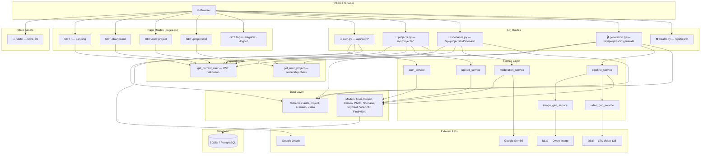
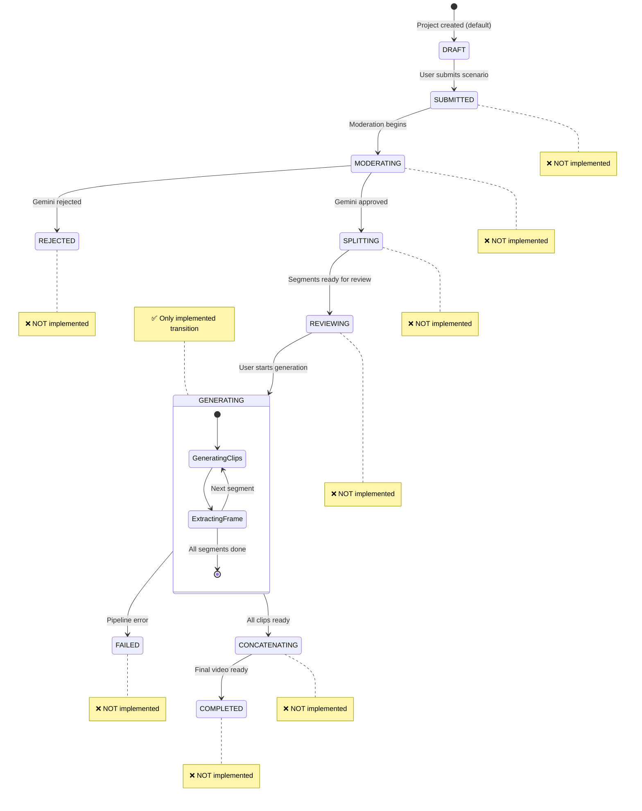
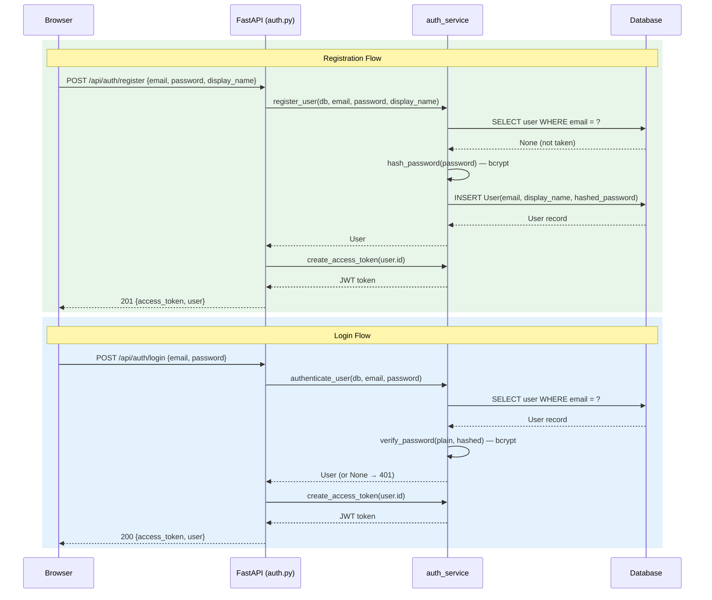
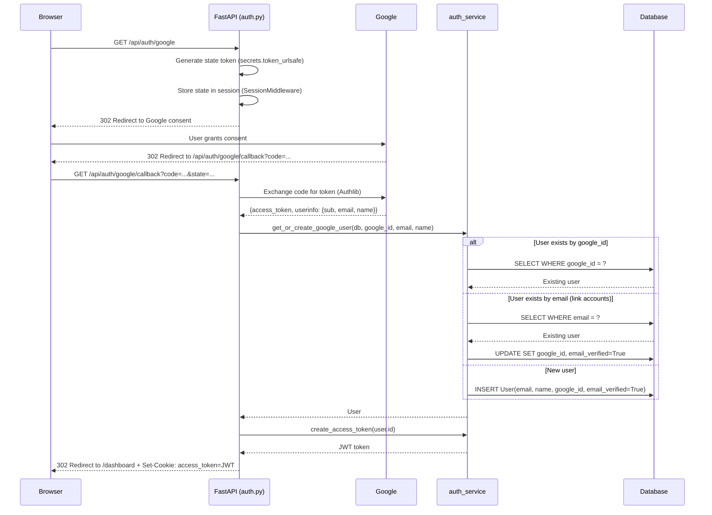
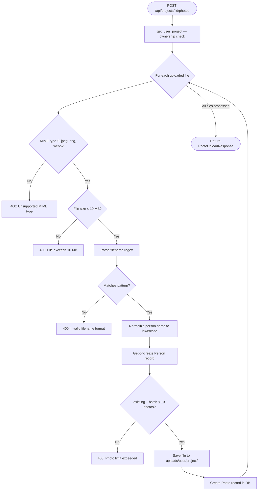
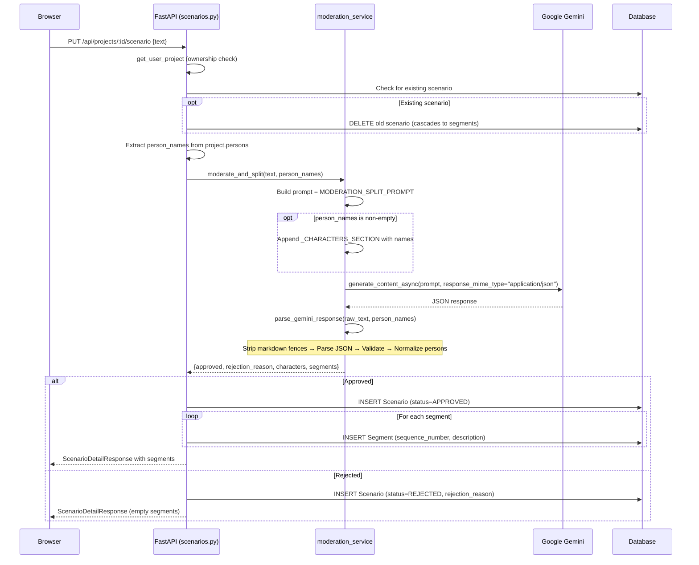
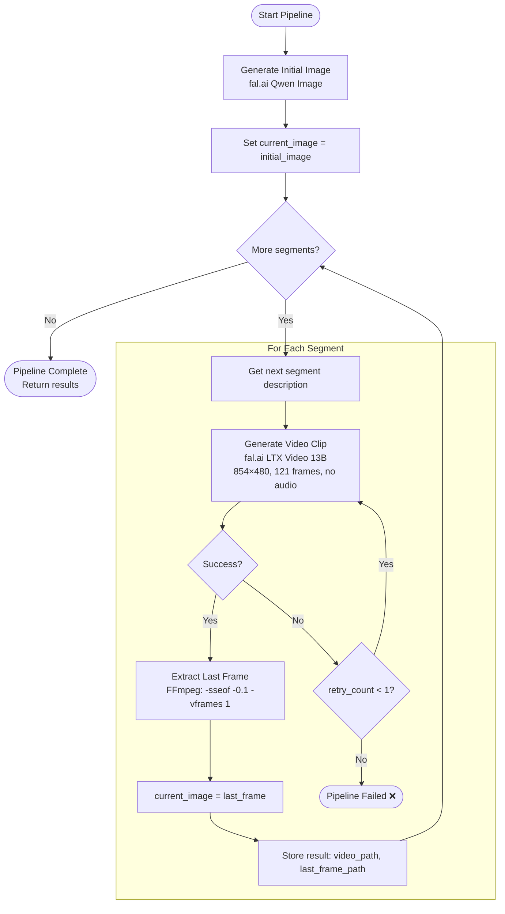
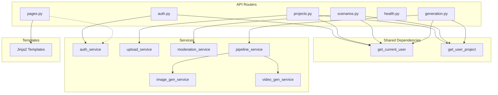

# Avatarium — Code Walkthrough

**Last verified against**: current `004-code-walkthrough-docs` branch  
**Platform**: AI-powered avatar video generation  
**Stack**: Python 3.12+ · FastAPI · SQLAlchemy (async) · Jinja2 · fal.ai · Google Gemini · JWT/bcrypt · Authlib

---

## Table of Contents

1. [Architecture Overview](#1-architecture-overview)
2. [Configuration System](#2-configuration-system)
3. [Database Layer](#3-database-layer)
4. [Data Model & Enums](#4-data-model--enums)
5. [Authentication Flow](#5-authentication-flow)
6. [Photo Upload Pipeline](#6-photo-upload-pipeline)
7. [AI Moderation & Scenario Splitting](#7-ai-moderation--scenario-splitting)
8. [Video Generation Pipeline](#8-video-generation-pipeline)
9. [API Reference](#9-api-reference)
10. [Frontend & Templates](#10-frontend--templates)
11. [Middleware](#11-middleware)
12. [Logging](#12-logging)
13. [Test Infrastructure](#13-test-infrastructure)
14. [Migrations](#14-migrations)
15. [Implementation Status](#15-implementation-status)
16. [File Reference Index](#16-file-reference-index)

---

## 1. Architecture Overview

Avatarium is a server-rendered FastAPI application with API endpoints that power both the Jinja2 template pages and any future client integrations. The architecture is organized into distinct layers, each with a clear responsibility.

### Layers

| Layer | Responsibility | Key Files |
|-------|---------------|-----------|
| **Client / Browser** | Renders HTML, executes JS for upload, polling, and auth token management | `static/js/app.js`, `static/css/style.css` |
| **Static Assets** | Served by FastAPI's `StaticFiles` mount at `/static` | `static/` directory |
| **Page Routes** | Server-rendered HTML pages via Jinja2; cookie-based auth | `backend/api/pages.py` |
| **API Routes** | JSON REST endpoints; Bearer JWT auth | `backend/api/auth.py`, `projects.py`, `scenarios.py`, `generation.py`, `health.py` |
| **Dependencies** | Shared FastAPI dependencies (ownership verification, auth) | `backend/api/dependencies.py`, `backend/api/auth.py::get_current_user` |
| **Service Layer** | Business logic; isolated from HTTP concerns | `backend/services/auth_service.py`, `upload_service.py`, `moderation_service.py`, `pipeline_service.py`, `image_gen_service.py`, `video_gen_service.py` |
| **Data Layer** | SQLAlchemy ORM models + Pydantic schemas | `backend/models/`, `backend/schemas/` |
| **Database** | Async SQLite (dev) / PostgreSQL (prod) via `aiosqlite` | `backend/database.py` |
| **External APIs** | fal.ai (image + video generation), Google Gemini (moderation), Google OAuth | Called from service layer |

### Application Entry Point

`backend/main.py` contains the `create_app()` factory function:

1. Creates the `FastAPI` instance with a `lifespan` context manager
2. On startup: calls `setup_logging()`, then `create_all()` in development mode
3. On shutdown: calls `dispose_engine()` to clean up the connection pool
4. Attaches the `SlowAPI` rate limiter to `app.state.limiter`
5. Adds `SessionMiddleware` (required for OAuth state persistence)
6. Mounts `/static` for CSS/JS assets
7. Includes all 6 routers: health, auth, projects, scenarios, generation, pages



---

## 2. Configuration System

**File**: `backend/config.py`

All configuration is loaded from environment variables (or a `.env` file) using `pydantic-settings`. A single `Settings` class holds every configurable value with sensible defaults.

### Settings Groups

| Group | Variables | Purpose |
|-------|-----------|---------|
| **App** | `app_env`, `app_secret_key`, `app_host`, `app_port` | Runtime environment, session secret, bind address |
| **Database** | `database_url` | SQLAlchemy connection string (default: `sqlite+aiosqlite:///./avatarium.db`) |
| **fal.ai** | `fal_key`, `fal_image_model`, `fal_video_model` | API key and model identifiers for image/video generation |
| **Gemini** | `gemini_api_key`, `gemini_model` | Google Gemini API for content moderation (default: `gemini-2.5-flash`) |
| **Google OAuth** | `google_client_id`, `google_client_secret`, `google_redirect_uri` | OAuth 2.0 / OpenID Connect credentials |
| **JWT** | `jwt_secret_key`, `jwt_algorithm`, `jwt_expiration_minutes` | Token signing (HS256, 60-minute expiry) |
| **Rate Limiting** | `rate_limit_default` | SlowAPI default rate (default: `10/minute`) |

### Key Patterns

- **Singleton**: `settings = Settings()` is instantiated at module level — all modules import the same instance.
- **Environment detection**: Two computed properties:
  - `is_development` → `app_env == "development"` (enables SQL echo, auto-create tables)
  - `is_production` → `app_env == "production"` (secure cookies, no auto-create)
- **Case-insensitive**: `case_sensitive=False` in the model config means `APP_ENV` and `app_env` both work.

---

## 3. Database Layer

**File**: `backend/database.py`

### Async Engine & Session

```python
engine = create_async_engine(settings.database_url, echo=settings.is_development, future=True)

async_session_factory = async_sessionmaker(
    engine, class_=AsyncSession, expire_on_commit=False
)
```

- **`expire_on_commit=False`**: Prevents lazy-load attribute access errors after `commit()` in async context. Objects remain usable without issuing new queries.
- **`future=True`**: Enables SQLAlchemy 2.0 style.

### `get_db()` Dependency

```python
async def get_db() -> AsyncGenerator[AsyncSession, None]:
    async with async_session_factory() as session:
        try:
            yield session
            await session.commit()
        except Exception:
            await session.rollback()
            raise
```

This FastAPI dependency:
1. Opens a session from the factory
2. Yields it to the route handler
3. **Auto-commits** on success — route handlers never call `commit()` directly, only `flush()` to get IDs
4. **Auto-rolls-back** on any exception
5. Session is closed when the `async with` block exits

### Helper Functions

| Function | Purpose |
|----------|---------|
| `create_all()` | Creates all tables from `Base.metadata` — only called in development via the lifespan startup |
| `dispose_engine()` | Disposes the connection pool — called during lifespan shutdown |

### Entity-Relationship Diagram

```mermaid
erDiagram
    users {
        UUID id PK
        String email UK "max 255"
        String display_name "max 100"
        String hashed_password "nullable"
        String google_id UK "nullable"
        Boolean email_verified "default false"
        DateTime terms_accepted_at "nullable"
        DateTime created_at
        DateTime updated_at
    }

    projects {
        UUID id PK
        UUID user_id FK "→ users.id CASCADE"
        String title "max 200"
        Enum video_style "animation | movie_like"
        Enum status "10 values, default draft"
        Numeric estimated_cost "nullable"
        Numeric actual_cost "nullable"
        DateTime created_at
        DateTime updated_at
    }

    persons {
        UUID id PK
        UUID project_id FK "→ projects.id CASCADE"
        String name "max 100"
        DateTime created_at
    }

    photos {
        UUID id PK
        UUID person_id FK "→ persons.id CASCADE"
        String original_filename "max 255"
        Integer sequence_number
        String file_path "max 500"
        Integer file_size
        String mime_type "max 50"
        DateTime created_at
    }

    scenarios {
        UUID id PK
        UUID project_id FK UK "→ projects.id CASCADE"
        Text text
        Enum moderation_status "pending | approved | rejected"
        Text rejection_reason "nullable"
        DateTime created_at
        DateTime moderated_at "nullable"
    }

    segments {
        UUID id PK
        UUID scenario_id FK "→ scenarios.id CASCADE"
        Integer sequence_number
        Text description
        Float estimated_duration "default 5.0"
        Enum generation_status "pending | generating | completed | failed"
    }

    video_clips {
        UUID id PK
        UUID project_id FK "→ projects.id CASCADE"
        UUID segment_id FK "→ segments.id CASCADE"
        Integer sequence_number
        String input_image_path "nullable"
        String video_file_path "nullable"
        String last_frame_path "nullable"
        Float duration "nullable"
        Numeric generation_cost "nullable"
        Enum status "pending | generating | completed | failed"
        Integer retry_count "default 0"
        Text error_message "nullable"
        DateTime created_at
        DateTime updated_at
    }

    final_videos {
        UUID id PK
        UUID project_id FK UK "→ projects.id CASCADE"
        String file_path "max 500"
        Float total_duration
        Numeric total_cost
        Integer file_size
        DateTime created_at
    }

    users ||--o{ projects : "owns"
    projects ||--o{ persons : "has"
    persons ||--o{ photos : "has"
    projects ||--o| scenarios : "has one"
    scenarios ||--o{ segments : "split into"
    projects ||--o{ video_clips : "generates"
    segments ||--o{ video_clips : "produces"
    projects ||--o| final_videos : "produces one"
```

---

## 4. Data Model & Enums

### Table Descriptions

#### `users` — `backend/models/user.py`

| Column | Type | Constraints | Notes |
|--------|------|-------------|-------|
| `id` | UUID | PK, auto-generated | `uuid.uuid4` default |
| `email` | String(255) | UNIQUE, NOT NULL, indexed | Login identifier |
| `display_name` | String(100) | NOT NULL | Shown in UI |
| `hashed_password` | String(255) | nullable | NULL for Google-only accounts |
| `google_id` | String(255) | UNIQUE, nullable | Populated on Google OAuth |
| `email_verified` | Boolean | NOT NULL, default `False` | Auto-set `True` for Google OAuth; **no verification flow exists** — see [Section 15](#15-implementation-status) |
| `terms_accepted_at` | DateTime(tz) | nullable | Column exists but **no acceptance flow** — see [Section 15](#15-implementation-status) |
| `created_at` | DateTime(tz) | NOT NULL, server_default `now()` | |
| `updated_at` | DateTime(tz) | NOT NULL, server_default `now()`, onupdate | |

#### `projects` — `backend/models/project.py`

| Column | Type | Constraints | Notes |
|--------|------|-------------|-------|
| `id` | UUID | PK | |
| `user_id` | UUID | FK → `users.id` CASCADE, NOT NULL, indexed | Ownership |
| `title` | String(200) | NOT NULL | |
| `video_style` | Enum(VideoStyle) | NOT NULL | `animation` or `movie_like` |
| `status` | Enum(ProjectStatus) | NOT NULL, default `draft` | 10-value lifecycle — see state diagram below |
| `estimated_cost` | Numeric(6,4) | nullable | Pre-generation estimate |
| `actual_cost` | Numeric(6,4) | nullable | Post-generation actual |
| `created_at` | DateTime(tz) | NOT NULL | |
| `updated_at` | DateTime(tz) | NOT NULL, onupdate | |

**Relationships**: `persons` loaded via `selectin` eager loading (always available without extra queries).

#### `persons` — `backend/models/project.py`

| Column | Type | Constraints | Notes |
|--------|------|-------------|-------|
| `id` | UUID | PK | |
| `project_id` | UUID | FK → `projects.id` CASCADE, NOT NULL, indexed | |
| `name` | String(100) | NOT NULL | Derived from photo filenames (e.g., `alice` from `alice_1.jpg`) |
| `created_at` | DateTime(tz) | NOT NULL | |

**Unique constraint**: `(project_id, name)` — one person per name per project.
**Relationships**: `photos` loaded via `selectin`.

#### `photos` — `backend/models/project.py`

| Column | Type | Constraints | Notes |
|--------|------|-------------|-------|
| `id` | UUID | PK | |
| `person_id` | UUID | FK → `persons.id` CASCADE, NOT NULL, indexed | |
| `original_filename` | String(255) | NOT NULL | Original upload filename |
| `sequence_number` | Integer | NOT NULL | From filename (e.g., `1` from `alice_1.jpg`) |
| `file_path` | String(500) | NOT NULL | `uploads/{user_id}/{project_id}/{filename}` |
| `file_size` | Integer | NOT NULL | Bytes |
| `mime_type` | String(50) | NOT NULL | `image/jpeg`, `image/png`, or `image/webp` |
| `created_at` | DateTime(tz) | NOT NULL | |

**Unique constraint**: `(person_id, sequence_number)` — no duplicate sequence per person.

#### `scenarios` — `backend/models/scenario.py`

| Column | Type | Constraints | Notes |
|--------|------|-------------|-------|
| `id` | UUID | PK | |
| `project_id` | UUID | FK → `projects.id` CASCADE, UNIQUE, NOT NULL, indexed | **One scenario per project** |
| `text` | Text | NOT NULL | Raw user-submitted scenario |
| `moderation_status` | Enum(ModerationStatus) | NOT NULL, default `pending` | |
| `rejection_reason` | Text | nullable | Populated by Gemini on rejection |
| `created_at` | DateTime(tz) | NOT NULL | |
| `moderated_at` | DateTime(tz) | nullable | Timestamp of moderation response |

**Relationships**: `segments` loaded via `selectin`, ordered by `sequence_number`.

#### `segments` — `backend/models/scenario.py`

| Column | Type | Constraints | Notes |
|--------|------|-------------|-------|
| `id` | UUID | PK | |
| `scenario_id` | UUID | FK → `scenarios.id` CASCADE, NOT NULL, indexed | |
| `sequence_number` | Integer | NOT NULL | 1-based ordering |
| `description` | Text | NOT NULL | Scene description for video generation |
| `estimated_duration` | Float | NOT NULL, default `5.0` | Seconds |
| `generation_status` | Enum(GenerationStatus) | NOT NULL, default `pending` | |

**Unique constraint**: `(scenario_id, sequence_number)`.

#### `video_clips` — `backend/models/video.py`

| Column | Type | Constraints | Notes |
|--------|------|-------------|-------|
| `id` | UUID | PK | |
| `project_id` | UUID | FK → `projects.id` CASCADE, NOT NULL, indexed | |
| `segment_id` | UUID | FK → `segments.id` CASCADE, NOT NULL, indexed | |
| `sequence_number` | Integer | NOT NULL | Matches segment sequence |
| `input_image_path` | String(500) | nullable | Path to input frame |
| `video_file_path` | String(500) | nullable | Path to generated clip |
| `last_frame_path` | String(500) | nullable | Extracted last frame for chaining |
| `duration` | Float | nullable | Actual clip duration |
| `generation_cost` | Numeric(6,4) | nullable | fal.ai API cost |
| `status` | Enum(ClipStatus) | NOT NULL, default `pending` | |
| `retry_count` | Integer | NOT NULL, default `0` | |
| `error_message` | Text | nullable | Populated on failure |
| `created_at` | DateTime(tz) | NOT NULL | |
| `updated_at` | DateTime(tz) | NOT NULL, onupdate | |

#### `final_videos` — `backend/models/video.py`

| Column | Type | Constraints | Notes |
|--------|------|-------------|-------|
| `id` | UUID | PK | |
| `project_id` | UUID | FK → `projects.id` CASCADE, UNIQUE, NOT NULL, indexed | **One final video per project** |
| `file_path` | String(500) | NOT NULL | |
| `total_duration` | Float | NOT NULL | |
| `total_cost` | Numeric(6,4) | NOT NULL | |
| `file_size` | Integer | NOT NULL | |
| `created_at` | DateTime(tz) | NOT NULL | |

> ⚠️ **Note**: The `FinalVideo` model exists in code but is **never instantiated** — no concatenation service creates final videos. See [Section 15](#15-implementation-status).

### Enum Types

#### `VideoStyle` — `backend/models/project.py`

| Value | Description |
|-------|-------------|
| `animation` | Cartoon/stylized animation style — prompt prefix: "cartoon, stylized animation style" |
| `movie_like` | Realistic/cinematic movie style — prompt prefix: "realistic, cinematic movie style" |

#### `ProjectStatus` — `backend/models/project.py`

| Value | Intended Meaning | Actually Used? |
|-------|------------------|----------------|
| `draft` | Initial state on creation | ✅ Default value |
| `submitted` | User submitted scenario | ❌ Never assigned |
| `moderating` | Gemini moderation in progress | ❌ Never assigned |
| `splitting` | Scenario being split into segments | ❌ Never assigned |
| `reviewing` | User reviewing segments | ❌ Never assigned |
| `generating` | Video pipeline running | ✅ Set in `generation.py` |
| `concatenating` | Clips being joined | ❌ Never assigned |
| `completed` | Final video ready | ❌ Never assigned |
| `rejected` | Scenario failed moderation | ❌ Never assigned |
| `failed` | Pipeline error | ❌ Never assigned |

See the [Project Status State Machine](#project-status-state-machine) below for the full intended lifecycle.

#### `ModerationStatus` — `backend/models/scenario.py`

| Value | Description | Used? |
|-------|-------------|-------|
| `pending` | Default — awaiting moderation | ✅ Default |
| `approved` | Gemini approved the scenario | ✅ Set in `scenarios.py` |
| `rejected` | Gemini rejected the scenario | ✅ Set in `scenarios.py` |

#### `GenerationStatus` — `backend/models/scenario.py`

| Value | Description | Used? |
|-------|-------------|-------|
| `pending` | Awaiting video generation | ✅ Default |
| `generating` | Currently being generated | ❌ Never assigned |
| `completed` | Clip generated successfully | ❌ Never assigned |
| `failed` | Generation failed | ❌ Never assigned |

#### `ClipStatus` — `backend/models/video.py`

| Value | Description | Used? |
|-------|-------------|-------|
| `pending` | Awaiting generation | ✅ Default |
| `generating` | Currently generating | ❌ Never assigned |
| `completed` | Generated successfully | ❌ Never assigned |
| `failed` | Generation failed | ❌ Never assigned |

### Project Status State Machine

The following diagram shows the **intended** full lifecycle as designed by the `ProjectStatus` enum. Since most transitions are not yet wired in code, transitions are annotated with their implementation status.



> ⚠️ **Current state**: Only two transitions are implemented:
> 1. `→ DRAFT` — automatic default when a project is created
> 2. `any → GENERATING` — triggered by `POST /api/projects/{id}/generate` in `generation.py`
>
> All other transitions exist as intended design but have no code to trigger them. The scenario moderation flow in `scenarios.py` sets `ModerationStatus` on the `Scenario` record but does **not** update `ProjectStatus`.

---

## 5. Authentication Flow

**Files**: `backend/api/auth.py`, `backend/services/auth_service.py`, `backend/api/pages.py`, `backend/schemas/auth.py`

Avatarium supports two authentication methods that share a unified `User` model:

1. **Email / password** — registration and login with bcrypt hashing
2. **Google OAuth** — via Authlib's OpenID Connect integration

### Authentication Mechanisms

#### JWT Tokens (API Routes)
- Created by `create_access_token(user_id)` with payload: `{sub: str(user_id), exp, iat}`
- Signed with `HS256` using `jwt_secret_key`, expires in 60 minutes (configurable)
- Passed as `Authorization: Bearer <token>` header
- Validated by `get_current_user` dependency (extracts from `HTTPBearer`)

#### Cookie Auth (Page Routes)
- Google OAuth callback sets an `access_token` cookie (httponly=False, samesite=lax)
- `pages.py` reads the cookie via `_get_current_user_or_none(request, db)`
- Pages redirect to `/login` if no valid cookie is found

### Account Linking
`get_or_create_google_user(db, google_id, email, display_name)` performs a three-step lookup:
1. Find by `google_id` → return existing user
2. Find by `email` → link the Google account (set `google_id`, set `email_verified=True`)
3. Neither found → create new user with `email_verified=True`

### Scaffolded Features
- **`email_verified`** column exists but **no email verification flow** (no verification email, no token, no endpoint). Google OAuth users get `True` automatically; email registrations stay `False`. See [Section 15](#15-implementation-status).
- **`terms_accepted_at`** column exists but **no Terms of Use acceptance flow** (no endpoint, no middleware gate). See [Section 15](#15-implementation-status).

### Email Registration & Login Sequence



### Google OAuth Sequence



---

## 6. Photo Upload Pipeline

**Files**: `backend/api/projects.py` (upload endpoint), `backend/services/upload_service.py`, `backend/api/dependencies.py`

Uploading photos establishes the "cast" of person characters for a project. Each photo is assigned to a person derived from the filename convention `<personName>_<sequenceNumber>.<ext>`.

### Validation Gates

1. **Ownership**: `get_user_project(project_id, user_id, db)` verifies the project belongs to the authenticated user (returns 404 if not)
2. **MIME type**: Must be one of `image/jpeg`, `image/png`, `image/webp`
3. **File size**: Maximum 10 MB (10,485,760 bytes)
4. **Filename format**: Must match regex `^(?P<person>[a-zA-Z0-9]+)_(?P<seq>\d+)\.(?P<ext>[a-zA-Z0-9]+)$`
5. **Extension**: Derived extension must be in `{jpg, jpeg, png, webp}`
6. **Photo count**: Maximum 10 photos per person per project

### Person Management
- Person name is extracted from filename and normalized to lowercase (`Alice_1.jpg` → person `alice`)
- Persons are **get-or-created**: if a person with that name already exists for the project, photos are added to it
- Unique constraint `(project_id, name)` prevents duplicate person records

### Storage Pattern
Files are saved to: `uploads/{user_id}/{project_id}/{original_filename}`

Each user's data is completely isolated by the directory structure.

### Upload Flow



---

## 7. AI Moderation & Scenario Splitting

**Files**: `backend/api/scenarios.py`, `backend/services/moderation_service.py`, `backend/schemas/scenario.py`

When a user submits a scenario, it is sent to Google Gemini in a single API call that performs **both** content moderation and scene splitting simultaneously.

### Prompt Architecture

The prompt has two parts assembled dynamically:

1. **`MODERATION_SPLIT_PROMPT`** (always included): Contains content policy rules (violence, sexual content, hate speech, illegal activities, minor exploitation, self-harm) and splitting rules (max 15 segments, ~5s each, coherent scenes, visual details).

2. **`_CHARACTERS_SECTION`** (appended only when `person_names` is non-empty): Instructs Gemini to:
   - Reference each character by name in segments where they appear
   - Invent a short visual description (2-3 traits) per character and **reuse it exactly**
   - Describe spatial relationships instead of frame positions
   - Populate a `"characters"` manifest mapping `name → visual_description`
   - Populate per-segment `"persons"` arrays listing character names present

### Response Parsing (`parse_gemini_response`)

1. Strip markdown code fences (`` ```json ... ``` ``) if present
2. Parse JSON
3. Validate required keys: `approved`, `segments`
4. Enforce max 15 segments (truncate if exceeded)
5. Validate `characters` is `dict[str, str]` (if persons provided)
6. Per-segment validation:
   - `persons` must be `list[str]`
   - Normalize all names to lowercase
   - Filter out names not in the project's person list

### Re-submission
If a scenario already exists for the project, it is **deleted** (cascading to segments) before creating the new one. This allows users to iterate on their scenario.

### Moderation & Splitting Sequence



---

## 8. Video Generation Pipeline

**Files**: `backend/services/pipeline_service.py`, `backend/services/image_gen_service.py`, `backend/services/video_gen_service.py`, `backend/api/generation.py`

The video generation pipeline iteratively creates a video clip for each segment, chaining clips together by extracting the last frame of each clip to use as the input image for the next.

### Pipeline Steps

1. **Initial Image Generation** (`image_gen_service.generate_initial_image`):
   - Takes the first segment's description + style directive
   - Calls fal.ai Qwen Image model via `fal_client.subscribe()`
   - Style prefix: `"cartoon, stylized animation style"` (animation) or `"realistic, cinematic movie style"` (movie_like)
   - Downloads the result via `httpx` and saves locally

2. **Iterative Video Clip Generation** (for each segment):
   - `video_gen_service.generate_video_clip()` calls fal.ai LTX Video 13B
   - Parameters: 854×480 resolution, 121 frames (~5s at 24fps), no audio
   - Input: current image + segment description as prompt
   - Output: MP4 video clip downloaded via `httpx`

3. **Last Frame Extraction** (`video_gen_service.extract_last_frame`):
   - Runs FFmpeg subprocess: `ffmpeg -sseof -0.1 -i clip.mp4 -vframes 1 -y last_frame.jpg`
   - Extracts the final frame to use as input for the next segment's video

4. **Chaining**: The extracted last frame becomes `current_image` for the next iteration

### Retry Logic
- `MAX_RETRIES = 1` — each failed clip is retried once
- If the retry also fails, the entire pipeline raises `RuntimeError`

### Output Structure
```
{output_dir}/
├── images/
│   ├── initial_image.jpg
│   ├── last_frame_1.jpg
│   ├── last_frame_2.jpg
│   └── ...
└── clips/
    ├── clip_1.mp4
    ├── clip_2.mp4
    └── ...
```

### ⚠️ Critical Gap: `launch_pipeline()` Is a Placeholder

The `launch_pipeline()` function in `generation.py` has a body of `pass`. It is called after setting the project status to `GENERATING`, but it **never actually invokes `pipeline_service.run_pipeline()`**. The pipeline logic is complete as a synchronous-style async function, but the background task wiring is missing. See [Section 15](#15-implementation-status).

### Pipeline Flow



---

## 9. API Reference

### Health

| Method | Path | Auth | Request | Response |
|--------|------|------|---------|----------|
| `GET` | `/api/health` | No | — | `{"status": "ok"}` |

### Auth — `backend/api/auth.py` (prefix: `/api/auth`)

| Method | Path | Auth | Request Schema | Response Schema |
|--------|------|------|---------------|----------------|
| `POST` | `/api/auth/register` | No | `RegisterRequest` | `AuthResponse` (201) |
| `POST` | `/api/auth/login` | No | `LoginRequest` | `AuthResponse` |
| `GET` | `/api/auth/me` | Yes (Bearer) | — | `UserResponse` |
| `GET` | `/api/auth/google` | No | — | 302 → Google |
| `GET` | `/api/auth/google/callback` | No | Query: code, state | 302 → /dashboard + cookie |

### Projects — `backend/api/projects.py` (prefix: `/api/projects`)

| Method | Path | Auth | Request Schema | Response Schema |
|--------|------|------|---------------|----------------|
| `POST` | `/api/projects` | Yes | `CreateProjectRequest` | `ProjectResponse` (201) |
| `GET` | `/api/projects` | Yes | Query: page, per_page | `ProjectListResponse` |
| `GET` | `/api/projects/{id}` | Yes | — | `ProjectDetailResponse` |
| `DELETE` | `/api/projects/{id}` | Yes | — | 204 No Content |
| `POST` | `/api/projects/{id}/photos` | Yes | Multipart: photos[] | `PhotoUploadResponse` (201) |
| `GET` | `/api/projects/{id}/photos` | Yes | — | `PhotoGroupResponse` |
| `DELETE` | `/api/projects/{id}/photos/{photo_id}` | Yes | — | 204 No Content |

### Scenarios — `backend/api/scenarios.py` (prefix: `/api/projects`)

| Method | Path | Auth | Request Schema | Response Schema |
|--------|------|------|---------------|----------------|
| `PUT` | `/api/projects/{id}/scenario` | Yes | `SubmitScenarioRequest` | `ScenarioDetailResponse` |
| `GET` | `/api/projects/{id}/scenario` | Yes | — | `ScenarioDetailResponse` |

> **Note**: Shares prefix `/api/projects` with `projects.py` — scenario is a sub-resource of a project.

### Generation — `backend/api/generation.py` (prefix: `/api/projects`)

| Method | Path | Auth | Request Schema | Response Schema |
|--------|------|------|---------------|----------------|
| `POST` | `/api/projects/{id}/generate` | Yes | — | `{"status": "generating", "project_id": "..."}` (202) |
| `GET` | `/api/projects/{id}/status` | Yes | — | `PipelineStatusResponse` |

> **Note**: Also shares prefix `/api/projects`. `start_generation` checks for an approved scenario before launching.

### Pages — `backend/api/pages.py` (no prefix)

| Method | Path | Auth | Request | Response |
|--------|------|------|---------|----------|
| `GET` | `/` | Cookie (optional) | — | Landing page (or 302 → dashboard) |
| `GET` | `/login` | Cookie (optional) | — | Landing page (login form) |
| `GET` | `/register` | Cookie (optional) | — | Landing page (register form) |
| `GET` | `/logout` | — | — | 302 → / + delete cookie |
| `GET` | `/dashboard` | Cookie (required) | — | Dashboard page (or 302 → login) |
| `GET` | `/new-project` | Cookie (required) | — | New project form (or 302 → login) |
| `GET` | `/projects/{id}` | Cookie (required) | — | Project detail page (or 302 → login) |

### Shared Dependency: `get_user_project`

**File**: `backend/api/dependencies.py`

Used by `projects.py`, `scenarios.py`, and `generation.py`. Accepts optional `load_persons` parameter (default `True`) to control eager loading. Returns 404 if the project doesn't exist or doesn't belong to the user.

### Route-to-Service Map



---

## 10. Frontend & Templates

**Files**: `backend/templates/` (5 templates), `static/js/app.js`, `static/css/style.css`

### Template Inheritance Hierarchy

All pages extend `base.html`:

```
base.html
├── landing.html    — Public: hero section, how-it-works, auth forms
├── dashboard.html  — Protected: project grid loaded via JS fetch
├── new_project.html — Protected: project creation form + photo dropzone
└── project_detail.html — Protected: upload, scenario, segments, generation, video player
```

### `base.html` — Layout Template

- **Navbar**: Responsive, with conditional auth links (login/register vs. dashboard/logout)
- **Flash messages**: Container for JS-driven toast notifications
- **Footer**: Contains `<div class="ad-zone ad-zone--footer">` — a single ad zone placeholder
- **Assets**: Links `static/css/style.css` and `static/js/app.js`

> ⚠️ **Ad Zone Note**: The constitution mandates sidebar, banner, and interstitial ad zones. Currently only a footer ad zone exists as a placeholder `<div>` — not connected to any ad provider. See [Section 15](#15-implementation-status).

### Key Template Features

| Template | Key Features |
|----------|-------------|
| `landing.html` | Hero section, "How It Works" steps, toggle between login/register forms, Google OAuth button |
| `dashboard.html` | Project grid populated via JS `fetch` to `/api/projects`, create-new-project CTA |
| `new_project.html` | Title input, video style selector, photo drag-and-drop zone with person grouping preview, scenario textarea |
| `project_detail.html` | Photo upload area, scenario submission/review, segment list, generation trigger button, polling status, video player |

### Client-Side JavaScript — `static/js/app.js`

Key behaviors:

- **Filename validation**: Regex `<person>_<number>.<ext>` validated client-side before upload
- **Cookie-based token management**: Reads `access_token` cookie for API calls, sets `Authorization: Bearer` header
- **Project form submission**: Creates project via `POST /api/projects`, redirects to detail page
- **Drag-and-drop + file input**: Dual upload mechanism with person grouping preview (groups files by parsed person name before upload)
- **Scenario submission**: Sends scenario text to `PUT /api/projects/{id}/scenario`, displays moderation result
- **Generation polling**: After starting generation, periodically calls `GET /api/projects/{id}/status` to update progress UI
- **Character count**: Live character count for scenario textarea

### CSS — `static/css/style.css`

- 522 lines, mobile-first responsive design
- CSS custom properties for theming
- Key component styles: navbar, hero, project cards, dropzone, segment list, video player, ad zones
- Breakpoints for desktop (1024px+) and mobile (320px+)

---

## 11. Middleware

**Files**: `backend/middleware/rate_limit.py`, `backend/main.py`

### Rate Limiting (SlowAPI)

```python
limiter = Limiter(key_func=get_remote_address, default_limits=[settings.rate_limit_default])
```

- **Key function**: `get_remote_address` — rate limits by client IP
- **Default rate**: `10/minute` (configurable via `RATE_LIMIT_DEFAULT`)
- **Attachment**: `app.state.limiter = limiter` in `create_app()`
- **Error handler**: `_rate_limit_exceeded_handler` returns 429 Too Many Requests

### Session Middleware (Starlette)

```python
app.add_middleware(SessionMiddleware, secret_key=settings.app_secret_key)
```

- Required for Google OAuth state token persistence
- Stores `oauth_state` in the session during `GET /api/auth/google`
- Validated during callback to prevent CSRF
- Uses `app_secret_key` for session signing

---

## 12. Logging

**File**: `backend/logging_config.py`

### `setup_logging()`

Called once at application startup via the lifespan context manager.

- Creates a timestamped log file: `logs/session_YYYYMMDD_HHMMSS.log`
- The `logs/` directory lives at repository root (sibling of `backend/`)
- **Idempotent**: Clears all existing handlers before adding new ones (safe for restarts)

### Log Handlers

| Handler | Level | Destination |
|---------|-------|-------------|
| `FileHandler` | `DEBUG` (all levels) | `logs/session_{timestamp}.log` |
| `StreamHandler` | `INFO` and above | Console (stderr) |

### Log Format

```
2026-02-28 14:30:45 | INFO     | backend.main | Logging initialised — session log: logs/session_20260228_143045.log
```

Format string: `%(asctime)s | %(levelname)-8s | %(name)s | %(message)s`

---

## 13. Test Infrastructure

**File**: `tests/conftest.py`

### Test Database

- **In-memory SQLite** with `aiosqlite` driver: `sqlite+aiosqlite://`
- **`StaticPool`**: Shares a single connection across all test operations — required for in-memory SQLite where each connection gets a separate database
- **`expire_on_commit=False`**: Same as production, prevents lazy-load issues

### Fixtures

| Fixture | Scope | Auto | Purpose |
|---------|-------|------|---------|
| `setup_database` | function | ✅ autouse | Create all tables before each test, drop after — full isolation |
| `override_get_db` | — | — | Generator that yields a test session (mirrors production `get_db`) |
| `client` | function | — | `AsyncClient` with ASGI transport — makes real HTTP requests to the app without a server |
| `test_user` | function | — | Creates a user with known credentials in the test DB |
| `auth_token` | function | — | JWT token for `test_user` |
| `auth_headers` | function | — | `{"Authorization": "Bearer <token>"}` dict |
| `db_session` | function | — | Direct async session for test setup/assertions |

### Test App Override

The `client` fixture creates a fresh `FastAPI` app via `create_app()` and overrides the `get_db` dependency to use the test database, ensuring tests never touch the real database.

### Test Directory Structure

```
tests/
├── conftest.py              — Shared fixtures
├── unit/
│   ├── test_upload_service.py    — Filename parsing, validation, person grouping
│   ├── test_moderation_service.py — Gemini response parsing, validation
│   └── test_pipeline_service.py  — Pipeline orchestration logic
├── integration/
│   ├── test_auth_api.py          — Registration, login, OAuth endpoints
│   ├── test_project_api.py       — CRUD, photo upload endpoints
│   ├── test_scenario_api.py      — Scenario submission, moderation
│   └── test_generation_api.py    — Pipeline launch, status checking
└── contract/
    └── __init__.py               — ⚠️ Empty — no contract tests exist
```

> ⚠️ The `contract/` directory contains only `__init__.py` — no contract tests have been implemented. See [Section 15](#15-implementation-status).

---

## 14. Migrations

**Files**: `alembic.ini`, `migrations/env.py`, `migrations/versions/`

### Alembic Configuration

- **`script_location`**: `migrations`
- **Default DB URL**: `sqlite+aiosqlite:///./avatarium.db` (overridden from `settings.database_url` at runtime)
- **Target metadata**: `Base.metadata` from `backend.models`

### Async Migration Runner

`migrations/env.py` provides both offline and online modes:

- **Offline**: Emits SQL without connecting (for review)
- **Online**: Uses `async_engine_from_config` with `NullPool` to run migrations via `asyncio.run()`
- **URL override**: `config.set_main_option("sqlalchemy.url", settings.database_url)` ensures migrations use the same DB as the application

### Migration History

| Revision | Description |
|----------|-------------|
| `eddd53b29c3b` | Create `users` table |
| `a682b7710052` | Add `projects`, `persons`, `photos` tables |
| `8df2d3f8096a` | Add `scenarios`, `segments` tables |

> **Note**: The `video_clips` and `final_videos` tables are defined in `backend/models/video.py` but may be handled by `create_all()` in development rather than an explicit migration.

---

## 15. Implementation Status

The following features are **scaffolded** (models, schemas, or enum values exist) but lack functional implementation:

| Feature | Status | Severity | Detail | Relevant Section |
|---------|--------|----------|--------|-----------------|
| `launch_pipeline()` | **Placeholder** (`pass`) | 🔴 Critical | `generation.py` L22-35 — body is literally `pass`. Never calls `pipeline_service.run_pipeline()`. Docstring says "will be wired to BackgroundTasks or a task queue." | [Section 8](#8-video-generation-pipeline) |
| Video concatenation | **Not implemented** | 🔴 Critical | No concatenation service exists. `FinalVideo` model and `CONCATENATING` status are scaffolded. FFmpeg is only used for last-frame extraction. | [Section 8](#8-video-generation-pipeline) |
| `FinalVideoResponse` in project detail | **Stub** | 🟡 Medium | `schemas/project.py` L48: `final_video: dict \| None = None  # Will be FinalVideoResponse in Phase 6` | [Section 4](#4-data-model--enums) |
| Most `ProjectStatus` transitions | **Not wired** | 🔴 Critical | Only `→ GENERATING` is implemented. All other transitions (`SUBMITTED`, `MODERATING`, `SPLITTING`, `REVIEWING`, `CONCATENATING`, `COMPLETED`, `REJECTED`, `FAILED`) exist as enum values but are never assigned. | [Section 4](#4-data-model--enums) |
| `GenerationStatus` transitions | **Not wired** | 🟡 Medium | Segment `generation_status` stays at `pending` — no code updates it during pipeline execution. | [Section 4](#4-data-model--enums) |
| `ClipStatus` transitions | **Not wired** | 🟡 Medium | `VideoClip.status` stays at `pending` — no code updates it. | [Section 4](#4-data-model--enums) |
| Email verification | **Scaffolded column** | 🟡 Medium | `User.email_verified` exists (default `False`); Google OAuth auto-sets `True`. But no email sending, no verification token, no verification endpoint. Constitution mandates email verification for email/password registrations. | [Section 5](#5-authentication-flow) |
| Terms of Use acceptance | **Scaffolded column** | 🟡 Medium | `User.terms_accepted_at` exists but no acceptance endpoint, no middleware gate preventing access. Constitution mandates ToU presentation and acceptance before feature access. | [Section 5](#5-authentication-flow) |
| Contract tests | **Empty directory** | 🟢 Low | `tests/contract/` contains only `__init__.py`. | [Section 13](#13-test-infrastructure) |
| Ad integration | **Partial skeleton** | 🟢 Low | `base.html` has a single `ad-zone--footer` div. Constitution mandates sidebar, banner, and interstitial zones. No ad provider connected. | [Section 10](#10-frontend--templates) |

---

## 16. File Reference Index

Every backend Python file and where it is documented in this walkthrough:

| # | File | Section(s) |
|---|------|-----------|
| 1 | `backend/main.py` | [1. Architecture](#1-architecture-overview), [11. Middleware](#11-middleware) |
| 2 | `backend/config.py` | [2. Configuration](#2-configuration-system) |
| 3 | `backend/database.py` | [3. Database Layer](#3-database-layer) |
| 4 | `backend/logging_config.py` | [12. Logging](#12-logging) |
| 5 | `backend/models/__init__.py` | [4. Data Model](#4-data-model--enums) |
| 6 | `backend/models/user.py` | [4. Data Model](#4-data-model--enums), [5. Auth](#5-authentication-flow) |
| 7 | `backend/models/project.py` | [4. Data Model](#4-data-model--enums) |
| 8 | `backend/models/scenario.py` | [4. Data Model](#4-data-model--enums) |
| 9 | `backend/models/video.py` | [4. Data Model](#4-data-model--enums) |
| 10 | `backend/schemas/auth.py` | [5. Auth](#5-authentication-flow), [9. API Reference](#9-api-reference) |
| 11 | `backend/schemas/project.py` | [6. Upload](#6-photo-upload-pipeline), [9. API Reference](#9-api-reference) |
| 12 | `backend/schemas/scenario.py` | [7. Moderation](#7-ai-moderation--scenario-splitting), [9. API Reference](#9-api-reference) |
| 13 | `backend/schemas/video.py` | [8. Pipeline](#8-video-generation-pipeline), [9. API Reference](#9-api-reference) |
| 14 | `backend/api/dependencies.py` | [9. API Reference](#9-api-reference) |
| 15 | `backend/api/auth.py` | [5. Auth](#5-authentication-flow), [9. API Reference](#9-api-reference) |
| 16 | `backend/api/projects.py` | [6. Upload](#6-photo-upload-pipeline), [9. API Reference](#9-api-reference) |
| 17 | `backend/api/scenarios.py` | [7. Moderation](#7-ai-moderation--scenario-splitting), [9. API Reference](#9-api-reference) |
| 18 | `backend/api/generation.py` | [8. Pipeline](#8-video-generation-pipeline), [9. API Reference](#9-api-reference) |
| 19 | `backend/api/health.py` | [9. API Reference](#9-api-reference) |
| 20 | `backend/api/pages.py` | [10. Frontend](#10-frontend--templates), [9. API Reference](#9-api-reference) |
| 21 | `backend/services/auth_service.py` | [5. Auth](#5-authentication-flow) |
| 22 | `backend/services/upload_service.py` | [6. Upload](#6-photo-upload-pipeline) |
| 23 | `backend/services/moderation_service.py` | [7. Moderation](#7-ai-moderation--scenario-splitting) |
| 24 | `backend/services/pipeline_service.py` | [8. Pipeline](#8-video-generation-pipeline) |
| 25 | `backend/services/image_gen_service.py` | [8. Pipeline](#8-video-generation-pipeline) |
| 26 | `backend/services/video_gen_service.py` | [8. Pipeline](#8-video-generation-pipeline) |
| 27 | `backend/middleware/rate_limit.py` | [11. Middleware](#11-middleware) |

**Coverage**: 27/27 backend Python files documented (100%).
